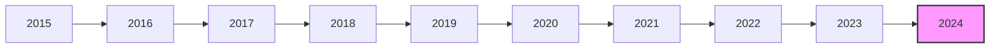

# Parsed Output
## Table of Contents
- [Chunk 0 — p. n/a: Vanguard Consumer Discretionary Index Fund](#chunk-0-vanguard-consumer-discretionary-index-fund)

---

## Chunk 0 — Page n/a

Fact sheet | June 30, 2025

# Vanguard Consumer Discretionary Index Fund

Sector fund | Admiral™ Shares

# # Fund facts

<table>
<tr>
<th>Risk level</th>
<th>Total net assets</th>
<th>Expense ratio as of 02/03/25</th>
<th>Ticker symbol</th>
<th>Turnover rate</th>
<th>Inception date</th>
<th>Fund number</th>
</tr>
<tr>
<td>Low 1 2 3 4 5 High</td>
<td>$658 MM</td>
<td>0.09%</td>
<td>VCDAX</td>
<td>6.1%</td>
<td>07/14/05</td>
<td>5483</td>
</tr>
</table>

# # Investment objective

Vanguard Consumer Discretionary Index Fund seeks to track the performance of a benchmark index that measures the investment return of consumer discretionary stocks.

# # Benchmark

Consumer Discretionary Spliced Idx

# # Growth of a $10,000 investment : January 31, 2015—December 31, 2024

$37,540 Fund as of 12/31/24
$37,795 Benchmark as of 12/31/24

# # Investment strategy

The fund employs a "passive management"—or indexing—investment approach designed to track the performance of MSCI US Investable Market Consumer Discretionary 25/50 Index, a benchmark of large, mid-, and small U.S. companies in the consumer discretionary sector, as classified under the Global Industry Classification Standard (GICS). This GICS sector is made up of those manufacturing and service industries that tend to be the most sensitive to economic cycles. Its manufacturing segment includes the following industries: automotive, household durable goods, textiles and apparel, and leisure equipment. The services segment includes hotels, restaurants and other leisure facilities, and retailing companies. The fund attempts to replicate the target index by investing all, or substantially all, of its assets in the stocks that make up the index, holding each stock in approximately the same proportion as its weighting in the index. The fund may also sample its target index by holding stocks that, in the aggregate, are intended to approximate the index in terms of key characteristics, such as price/earnings ratio, earnings growth, and dividend yield. Typically, the fund will use a sampling strategy only if regulatory constraints or other considerations prevent it from replicating the index.

# # Annual returns

<table>
<tr>
<th></th>
<th>2015</th>
<th>2016</th>
<th>2017</th>
<th>2018</th>
<th>2019</th>
<th>2020</th>
<th>2021</th>
<th>2022</th>
<th>2023</th>
<th>2024</th>
</tr>
<tr>
<td>Fund</td>
<td>6.35</td>
<td>6.64</td>
<td>22.83</td>
<td>-2.26</td>
<td>27.55</td>
<td>48.24</td>
<td>24.88</td>
<td>-35.17</td>
<td>40.40</td>
<td>24.39</td>
</tr>
<tr>
<td>Benchmark</td>
<td>6.43</td>
<td>6.72</td>
<td>22.90</td>
<td>-2.18</td>
<td>27.65</td>
<td>48.31</td>
<td>24.99</td>
<td>-35.13</td>
<td>40.48</td>
<td>24.48</td>
</tr>
</table>

# # Total returns

Periods ended June 30, 2025

<table>
<tr>
<th></th>
<th>Quarter</th>
<th>Year to date</th>
<th>One year</th>
<th>Three years</th>
<th>Five years</th>
<th>Ten years</th>
</tr>
<tr>
<td>Fund</td>
<td>11.48%</td>
<td>-3.13%</td>
<td>16.96%</td>
<td>17.85%</td>
<td>13.89%</td>
<td>12.73%</td>
</tr>
<tr>
<td>Benchmark</td>
<td>11.51%</td>
<td>-3.08%</td>
<td>17.06%</td>
<td>17.93%</td>
<td>13.96%</td>
<td>12.81%</td>
</tr>
</table>

The performance data shown represent past performance, which is not a guarantee of future results. Investment returns and principal value will fluctuate, so investors' shares, when sold, may be worth more or less than their original cost. Current performance may be lower or higher than the performance data cited. For performance data current to the most recent month-end, visit our website at vanguard.com/performance. The performance of an index is not an exact representation of any particular investment, as you cannot invest directly in an index.

Figures for periods of less than one year are cumulative returns. All other figures represent average annual returns. Performance figures include the reinvestment of all dividends and any capital gains distributions. All returns are net of expenses.

Consumer Discretionary Spliced Idx: MSCI US Investable Market Consumer Discretionary Index through February 26, 2010; MSCI US Investable Market Consumer Discretionary 25/50 Index through May 2, 2018; MSCI US Investable Market Consumer Discretionary 25/50 Transition Index through December 2, 2018; MSCI US Investable Market Consumer Discretionary 25/50 Index thereafter.

F5483 062025
# Parsed Output
## Table of Contents
- [Chunk 0 — p. n/a: Vanguard Consumer Discretionary Index Fund](#chunk-0-vanguard-consumer-discretionary-index-fund)

---

## Chunk 0 — Page n/a

Fact sheet | June 30, 2025

# Vanguard Consumer Discretionary Index Fund

Sector fund | Admiral™ Shares

# # Ten largest holdings*

1. Amazon.com Inc.
2. Tesla Inc.
3. Home Depot Inc.
4. McDonald's Corp.
5. Booking Holdings Inc.
6. TJX Cos. Inc.
7. MercadoLibre Inc.
8. Lowe's Cos. Inc.
9. Starbucks Corp.
10. DoorDash Inc.

Top 10 as % of total net assets: 59.8%

\* The holdings listed exclude any temporary cash investments and equity index products.

# # Sector Diversification

<table>
  <tr>
    <td>Broadline Retail</td>
<td>27.1%</td>
<td>Apparel Retail</td>
<td>4.0</td>
  </tr>
<tr>
    <td>Automobile Manufacturers</td>
<td>16.5</td>
<td>Homebuilding</td>
<td>3.2</td>
  </tr>
<tr>
    <td>Restaurants</td>
<td>10.9</td>
<td>Casinos & Gaming</td>
<td>2.7</td>
  </tr>
<tr>
    <td>Hotels, Resorts & Cruise Lines</td>
<td>9.2</td>
<td>Other Specialty Retail</td>
<td>2.1</td>
  </tr>
<tr>
    <td>Home Improvement Retail</td>
<td>7.8</td>
<td>Footwear</td>
<td>2.0</td>
  </tr>
<tr>
    <td>Automotive Retail</td>
<td>4.3</td>
<td>Other</td>
<td>10.2</td>
  </tr>
</table>

Sector categories are based on the Global Industry Classification Standard ("GICS"), except for the "Other" category (if applicable), which includes securities that have not been provided a GICS classification as of the effective reporting period.

# # Connect with Vanguard ® • vanguard.com

## # Plain talk about risk

An investment in the fund could lose money over short or even long periods. You should expect the fund's share price and total return to fluctuate within a wide range, like the fluctuations of the overall stock market. The fund's performance could be hurt by:

**Stock market risk:** The chance that stock prices overall will decline. Stock markets tend to move in cycles, with periods of rising stock prices and periods of falling stock prices. The fund's target index may, at times, become focused in stocks of a particular sector, category, or group of companies. Because the fund seeks to track its target index, the fund may underperform the overall stock market.

**Sector risk:** The chance that significant problems will affect a particular sector, or that returns from that sector will trail returns from the overall stock market. Daily fluctuations in specific market sectors are often more extreme or volatile than fluctuations in the overall market. Because the fund invests all, or substantially all, of its assets in the consumer discretionary sector, the fund's performance largely depends—for better or for worse—on the general condition of that sector. Companies in the consumer discretionary sector could be affected by, among other things, overall economic conditions, interest rates, consumer confidence, and disposable income. Sector risk is expected to be high for the fund.

**Nondiversification risk:** The chance that the fund's performance may be hurt disproportionately by the poor performance of relatively few stocks or even a single stock. The fund is considered nondiversified, which means that it may invest a greater percentage of its assets in the securities of a small number of issuers as compared with other mutual funds. Because the fund tends to invest a relatively high percentage of its assets in its ten largest holdings, fluctuations in the market value of a single fund holding could cause significant changes to the fund's share price. Nondiversification risk is expected to be high for the fund.

**Investment style risk:** The chance that returns from the types of stocks in which the fund invests will trail returns from the overall stock market. Small-, mid-, and large-cap stocks each tend to go through cycles of doing better—or worse—than other segments of the stock market or the stock market in general. These periods have, in the past, lasted for as long as several years. Historically, small- and mid-cap stocks have been more volatile in price than large-cap stocks. Small and mid-size companies tend to have greater stock volatility because, among other things, these companies are more sensitive to changing economic conditions.

**Index replicating risk**, which is the chance that the fund may be prevented from holding one or more securities in the same proportion as in its target index.

**Index-related risks:** The fund is subject to risks associated with index investing, which include passive management risk, tracking error risk, and index provider risk. Passive management risk is the chance that the fund's use of an indexing strategy will negatively impact the fund's performance. Because the fund seeks to track the performance of its target index regardless of how that index is performing, the fund's performance may be lower than it would be if the fund were actively managed. Tracking error risk is the chance that the fund's performance will deviate from the performance of its target index. Tracking error risk may be heightened during times of increased market volatility or under other unusual market conditions. Index provider risk is the chance that the fund will be negatively impacted by changes or errors made by the index provider. Any gains, losses, or costs associated with or resulting from an error made by the index provider will generally be borne by the fund and, as a result, the fund's shareholders.

## # Note on frequent trading restrictions

Frequent trading policies may apply to those funds offered as investment options within your plan. Please log on to vanguard.com for your employer plans or contact Participant Services at 800-523-1188 for additional information.

The funds or securities referred to herein are not sponsored, endorsed, or promoted by MSCI, and MSCI bears no liability with respect to any such funds or securities. The prospectus or the Statement of Additional Information contains a more detailed description of the limited relationship MSCI has with Vanguard and any related funds.

For more information about Vanguard funds or to obtain a prospectus, see below for which situation is right for you.

If you receive your retirement plan statement from Vanguard or log on to Vanguard's website to view your plan, visit vanguard.com or call 800-523-1188.

If you receive your retirement plan statement from a service provider other than Vanguard or log on to a recordkeeper's website that is not Vanguard to view your plan, please call 855-402-2646.

Visit vanguard.com to obtain a prospectus or, if available, a summary prospectus. Investment objectives, risks, charges, expenses, and other important information about a fund are contained in the prospectus; read and consider it carefully before investing.

Financial advisor clients: For more information about Vanguard funds, contact your financial advisor to obtain a prospectus.

Investment Products: Not FDIC Insured • No Bank Guarantee • May Lose Value

© 2025 The Vanguard Group, Inc. All rights reserved. Vanguard Marketing Corporation, Distributor. F5483 062025
