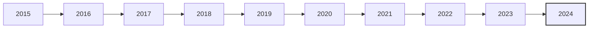

# Parsed Output
## Table of Contents
- [Chunk 0 — p. n/a: Vanguard Diversified Equity Fund](#chunk-0-vanguard-diversified-equity-fund)

---

## Chunk 0 — Page n/a

Fact sheet | June 30, 2025

# Vanguard Diversified Equity Fund

Domestic stock fund

# # Fund facts

<table>
<tr>
<th>Risk level</th>
<th>Total net assets</th>
<th>Expense ratio as of 02/28/25</th>
<th>Ticker symbol</th>
<th>Turnover rate</th>
<th>Inception date</th>
<th>Fund number</th>
</tr>
<tr>
<td>Low ◼ ◼ ◼ 4 ◼ High</td>
<td>$2,847 MM</td>
<td>0.35%*</td>
<td>VDEQX</td>
<td>4.9%</td>
<td>06/10/05</td>
<td>0608</td>
</tr>
</table>

# # Investment objective

Vanguard Diversified Equity Fund seeks to provide long-term capital appreciation and dividend income.

# # Benchmark

MSCI US Broad Market Index

# # Growth of a $10,000 investment : January 31, 2015—December 31, 2024

$32,052 Fund as of 12/31/24
$33,774 Benchmark as of 12/31/24

# # Investment strategy

As a "fund of funds," the Diversified Equity Fund invests in a diversified group of other Vanguard equity mutual funds, rather than in individual securities. The underlying funds' holdings mainly consist of large-, mid-, and small-capitalization equity securities of domestic companies.

# # Annual returns

<table>
<tr>
<th></th>
<th>2015</th>
<th>2016</th>
<th>2017</th>
<th>2018</th>
<th>2019</th>
<th>2020</th>
<th>2021</th>
<th>2022</th>
<th>2023</th>
<th>2024</th>
</tr>
<tr>
<td>Fund</td>
<td>0.73</td>
<td>8.47</td>
<td>22.70</td>
<td>-5.39</td>
<td>31.45</td>
<td>28.98</td>
<td>21.69</td>
<td>-22.47</td>
<td>27.49</td>
<td>20.63</td>
</tr>
<tr>
<td>Benchmark</td>
<td>0.57</td>
<td>12.67</td>
<td>21.21</td>
<td>-5.28</td>
<td>31.07</td>
<td>21.02</td>
<td>26.10</td>
<td>-19.23</td>
<td>26.21</td>
<td>23.81</td>
</tr>
</table>

# # Total returns

Periods ended June 30, 2025

<table>
<tr>
<th></th>
<th>Quarter</th>
<th>Year to date</th>
<th>One year</th>
<th>Three years</th>
<th>Five years</th>
<th>Ten years</th>
</tr>
<tr>
<td>Fund</td>
<td>12.05%</td>
<td>5.68%</td>
<td>13.90%</td>
<td>18.51%</td>
<td>14.60%</td>
<td>12.25%</td>
</tr>
<tr>
<td>Benchmark</td>
<td>11.08%</td>
<td>5.69%</td>
<td>15.20%</td>
<td>19.16%</td>
<td>16.10%</td>
<td>13.03%</td>
</tr>
</table>

The performance data shown represent past performance, which is not a guarantee of future results. Investment returns and principal value will fluctuate, so investors' shares, when sold, may be worth more or less than their original cost. Current performance may be lower or higher than the performance data cited. For performance data current to the most recent month-end, visit our website at vanguard.com/performance. The performance of an index is not an exact representation of any particular investment, as you cannot invest directly in an index.

Figures for periods of less than one year are cumulative returns. All other figures represent average annual returns. Performance figures include the reinvestment of all dividends and any capital gains distributions. All returns are net of expenses.

# # Allocation of underlying funds†

<table>
<tr>
<td>US Growth</td>
<td>30.5%</td>
<td>Windsor II</td>
<td>15.0</td>
</tr>
<tr>
<td>Growth and Income</td>
<td>20.4</td>
<td>Explorer</td>
<td>9.7</td>
</tr>
<tr>
<td>Windsor</td>
<td>19.3</td>
<td>Mid-Cap Growth</td>
<td>5.1</td>
</tr>
</table>

†Fund holdings are subject to change.

\* The acquired fund fees and expenses based on the fees and expenses of the underlying funds.

MSCI US Broad Market Index: Tracks virtually all stocks that trade in the U.S. stock market.
# Parsed Output
## Table of Contents
- [Chunk 0 — p. n/a: Vanguard Diversified Equity Fund](#chunk-0-vanguard-diversified-equity-fund)

---

## Chunk 0 — Page n/a

Fact sheet | June 30, 2025

# Vanguard Diversified Equity Fund

Domestic stock fund

Connect with Vanguard ® • vanguard.com

# # Plain talk about risk

An investment in the fund could lose money over short or even long periods. You should expect the fund's share price and total return to fluctuate within a wide range, like the fluctuations of the overall stock market. Because the fund invests substantially all of its assets in underlying funds, it is subject to underlying fund risk. This means that the fund is exposed to all of the risks associated with the investment strategies and policies of the underlying funds, including the risk that the underlying funds will not meet their investment objectives. The fund's performance could be hurt by:

<table>
<tr>
<th>Risk</th>
<th>Description</th>
</tr>
<tr>
<td>Stock market risk:</td>
<td>The chance that stock prices overall will decline. Stock markets tend to move in cycles, with periods of rising stock prices and periods of falling stock prices.</td>
</tr>
<tr>
<td>Manager risk:</td>
<td>The chance that poor security selection will cause one or more of the fund's actively managed underlying funds—and, thus, the fund itself—to underperform relevant benchmarks or other funds with a similar investment objective.</td>
</tr>
<tr>
<td>4</td>
<td>Asset allocation risk: The chance that the selection of underlying funds, and the allocation of a high percentage of assets to a relatively few number of underlying funds, may cause the fund to be hurt disproportionately by the poor performance of any one underlying fund or to underperform other funds with a similar investment objective.</td>
</tr>
</table>

# # Note on frequent trading restrictions

Frequent trading policies may apply to those funds offered as investment options within your plan. Please log on to vanguard.com for your employer plans or contact Participant Services at 800-523-1188 for additional information.

# # For more information about Vanguard funds or to obtain a prospectus, see below for which situation is right for you.

- If you receive your retirement plan statement from Vanguard or log on to Vanguard's website to view your plan, visit vanguard.com or call 800-523-1188.
- If you receive your retirement plan statement from a service provider other than Vanguard or log on to a recordkeeper's website that is not Vanguard to view your plan, please call 855-402-2646.
- Visit vanguard.com to obtain a prospectus or, if available, a summary prospectus. Investment objectives, risks, charges, expenses, and other important information about a fund are contained in the prospectus; read and consider it carefully before investing.
- Financial advisor clients: For more information about Vanguard funds, contact your financial advisor to obtain a prospectus.

Investment Products: Not FDIC Insured • No Bank Guarantee • May Lose Value

© 2025 The Vanguard Group, Inc. All rights reserved. Vanguard Marketing Corporation, Distributor. F0608 062025
