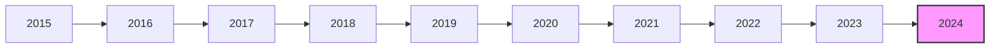

# Parsed Output
## Table of Contents
- [Chunk 0 — p. n/a: Vanguard Extended Market Index Fund](#chunk-0-vanguard-extended-market-index-fund)

---

## Chunk 0 — Page n/a

Fact sheet | June 30, 2025

# Vanguard Extended Market Index Fund

Domestic stock fund | Investor Shares

# # Fund facts

<table>
  <tr>
    <th>Risk level</th>
    <th>Total net assets</th>
    <th>Expense ratio as of 04/29/25</th>
    <th>Ticker symbol</th>
    <th>Turnover rate</th>
    <th>Inception date</th>
    <th>Fund number</th>
  </tr>
<tr>
    <td>Low 1 2 3 4 5 High</td>
<td>$175 MM</td>
<td>0.19%</td>
<td>VEXMX</td>
<td>10.6%</td>
<td>12/21/87</td>
<td>0098</td>
  </tr>
</table>

# # Investment objective

Vanguard Extended Market Index Fund seeks to track the performance of a benchmark index that measures the investment return of small- and mid-capitalization stocks.

# # Benchmark

Spliced Extended Market Index

# # Growth of a $10,000 investment : January 31, 2015—December 31, 2024

$24,836 Fund as of 12/31/24
$24,876 Benchmark as of 12/31/24

# # Investment strategy

The fund employs an indexing investment approach designed to track the performance of the Standard & Poor's Completion Index, a broadly diversified index of stocks of small and medium-size U.S. companies. The Standard & Poor's Completion Index contains all of the U.S. common stocks regularly traded on the New York and American Stock Exchanges, and the Nasdaq over-the-counter market, except those stocks included in the Standard & Poor's 500 Index. The fund invests all, or substantially all, of its assets in stocks of its target index, with nearly 80% of its assets invested in the 1,200 largest stocks in its target index (covering nearly 80% of the index's total market capitalization), and the rest of its assets in a representative sample of the remaining stocks. The fund holds a broadly diversified collection of securities that, in the aggregate, approximates the full index in terms of key characteristics. These key characteristics include industry weightings and market capitalization, as well as certain financial measures such as price/earnings ratio and dividend yield.

# # Annual returns

<table>
  <tr>
    <th></th>
    <th>2015</th>
    <th>2016</th>
    <th>2017</th>
    <th>2018</th>
    <th>2019</th>
    <th>2020</th>
    <th>2021</th>
    <th>2022</th>
    <th>2023</th>
    <th>2024</th>
  </tr>
<tr>
    <td>Fund</td>
<td>-3.39</td>
<td>15.99</td>
<td>17.94</td>
<td>-9.47</td>
<td>27.87</td>
<td>32.04</td>
<td>12.31</td>
<td>-26.56</td>
<td>25.22</td>
<td>16.76</td>
  </tr>
<tr>
    <td>Benchmark</td>
<td>-3.35</td>
<td>15.95</td>
<td>18.11</td>
<td>-9.57</td>
<td>27.95</td>
<td>32.17</td>
<td>12.35</td>
<td>-26.54</td>
<td>24.97</td>
<td>16.88</td>
  </tr>
</table>

# # Total returns

Periods ended June 30, 2025

<table>
  <tr>
    <th></th>
    <th>Quarter</th>
    <th>Year to date</th>
    <th>One year</th>
    <th>Three years</th>
    <th>Five years</th>
    <th>Ten years</th>
  </tr>
<tr>
    <td>Fund</td>
<td>12.12%</td>
<td>2.07%</td>
<td>15.43%</td>
<td>15.10%</td>
<td>11.48%</td>
<td>9.03%</td>
  </tr>
<tr>
    <td>Benchmark</td>
<td>12.16%</td>
<td>2.12%</td>
<td>15.57%</td>
<td>15.08%</td>
<td>11.51%</td>
<td>9.04%</td>
  </tr>
</table>

The performance data shown represent past performance, which is not a guarantee of future results. Investment returns and principal value will fluctuate, so investors' shares, when sold, may be worth more or less than their original cost. Current performance may be lower or higher than the performance data cited. For performance data current to the most recent month-end, visit our website at vanguard.com/performance. The performance of an index is not an exact representation of any particular investment, as you cannot invest directly in an index.

Figures for periods of less than one year are cumulative returns. All other figures represent average annual returns. Performance figures include the reinvestment of all dividends and any capital gains distributions. All returns are net of expenses.
# Parsed Output
## Table of Contents
- [Chunk 0 — p. n/a: Vanguard Extended Market Index Fund](#chunk-0-vanguard-extended-market-index-fund)

---

## Chunk 0 — Page n/a

Fact sheet | June 30, 2025

# Vanguard Extended Market Index Fund

Domestic stock fund | Investor Shares

# # Ten largest holdings*

1. MicroStrategy Inc.
2. AppLovin Corp.
3. Snowflake Inc.
4. Marvell Technology Inc.
5. Robinhood Markets Inc.
6. CRH plc
7. Cloudflare Inc.
8. ROBLOX Corp.
9. Cheniere Energy Inc.
10. Flutter Entertainment plc

Top 10 as % of total net assets: 9.1%

\* The holdings listed exclude any temporary cash investments and equity index products.

# # Sector Diversification

<table>
  <tr>
    <td>Information Tech</td>
<td>19.0%</td>
<td>Communication Services</td>
<td>4.4</td>
  </tr>
<tr>
    <td>Financials</td>
<td>18.2</td>
<td>Materials</td>
<td>4.4</td>
  </tr>
<tr>
    <td>Industrials</td>
<td>18.2</td>
<td>Energy</td>
<td>3.7</td>
  </tr>
<tr>
    <td>Health Care</td>
<td>11.1</td>
<td>Consumer Staples</td>
<td>3.0</td>
  </tr>
<tr>
    <td>Consumer Discretionary</td>
<td>10.7</td>
<td>Utilities</td>
<td>1.9</td>
  </tr>
<tr>
    <td>Real Estate</td>
<td>5.3</td>
<td>Other</td>
<td>0.1</td>
  </tr>
</table>

Sector categories are based on the Global Industry Classification Standard ("GICS"), except for the "Other" category (if applicable), which includes securities that have not been provided a GICS classification as of the effective reporting period.

# # Connect with Vanguard® • vanguard.com

## # Plain talk about risk

An investment in the fund could lose money over short or long periods of time. You should expect the fund's share price and total return to fluctuate within a wide range. The fund is subject to the following risks, which could affect the fund's performance:

**Stock market risk**, which is the chance that stock prices overall will decline. Stock markets tend to move in cycles, with periods of rising prices and periods of falling prices. The fund's target index tracks a subset of the U.S. stock market, which could cause the fund to perform differently from the overall stock market. In addition, the fund's target index may, at times, become focused in stocks of a particular market sector, which would subject the fund to proportionately higher exposure to the risks of that sector.

**Investment style risk**, which is the chance that returns from small- and mid-capitalization stocks will trail returns from the overall stock market. Historically, small- and mid-cap stocks have been more volatile in price than the large-cap stocks that dominate the overall market, and they often perform quite differently. The stock prices of small and mid-size companies tend to experience greater volatility because, among other things, these companies tend to be more sensitive to changing economic conditions.

**Index sampling risk**, which is the chance that the securities selected for the fund, in the aggregate, will not provide investment performance matching that of the fund's target index. Index sampling risk for the fund is expected to be low.

**Index-related risks**: The fund is subject to risks associated with index investing, which include passive management risk, tracking error risk, and index provider risk. Passive management risk is the chance that the fund's use of an indexing strategy will negatively impact the fund's performance. Because the fund seeks to track the performance of its target index regardless of how that index is performing, the fund's performance may be lower than it would be if the fund were actively managed. Tracking error risk is the chance that the fund's performance will deviate from the performance of its target index. Tracking error risk may be heightened during times of increased market volatility or under other unusual market conditions. Index provider risk is the chance that the fund will be negatively impacted by changes or errors made by the index provider. Any gains, losses, or costs associated with or resulting from an error made by the index provider will generally be borne by the fund and, as a result, the fund's shareholders.

## # Note on frequent trading restrictions

Frequent trading policies may apply to those funds offered as investment options within your plan. Please log on to vanguard.com for your employer plans or contact Participant Services at 800-523-1188 for additional information.

The index is a product of S&P Dow Jones Indices LLC, a division of S&P Global, or its affiliates ("SPDJI"), and has been licensed for use by Vanguard. Standard & Poor's® and S&P® are registered trademarks of Standard & Poor's Financial Services LLC, a division of S&P Global ("S&P"); Dow Jones® is a registered trademark of Dow Jones Trademark Holdings LLC ("Dow Jones"); and these trademarks have been licensed for use by SPDJI and sublicensed for certain purposes by Vanguard. Vanguard products are not sponsored, endorsed, sold or promoted by SPDJI, Dow Jones, S&P, or their respective affiliates and none of such parties make any representation regarding the advisability of investing in such product(s) nor do they have any liability for any errors, omissions, or interruptions of the index.

For more information about Vanguard funds or to obtain a prospectus, see below for which situation is right for you.

If you receive your retirement plan statement from Vanguard or log on to Vanguard's website to view your plan, visit vanguard.com or call 800-523-1188.

If you receive your retirement plan statement from a service provider other than Vanguard or log on to a recordkeeper's website that is not Vanguard to view your plan, please call 855-402-2646.

Visit vanguard.com to obtain a prospectus or, if available, a summary prospectus. Investment objectives, risks, charges, expenses, and other important information about a fund are contained in the prospectus; read and consider it carefully before investing.

Financial advisor clients: For more information about Vanguard funds, contact your financial advisor to obtain a prospectus.

Investment Products: Not FDIC Insured • No Bank Guarantee • May Lose Value

© 2025 The Vanguard Group, Inc. All rights reserved. Vanguard Marketing Corporation, Distributor. F0098 062025
