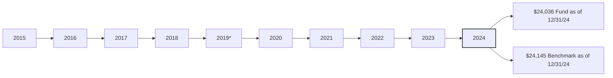

# Parsed Output
## Table of Contents
- [Chunk 0 — p. n/a: Vanguard S&P 500 Growth Index Fund](#chunk-0-vanguard-sp-500-growth-index-fund)

---

## Chunk 0 — Page n/a

Fact sheet | June 30, 2025

# Vanguard S&P 500 Growth Index Fund

Domestic stock fund | Institutional Shares

# # Fund facts

<table>
<tr>
<th>Risk level</th>
<th>Total net assets</th>
<th>Expense ratio as of 02/03/25</th>
<th>Ticker symbol</th>
<th>Turnover rate</th>
<th>Inception date</th>
<th>Fund number</th>
</tr>
<tr>
<td>Low 4 High 1 2 3 4 5</td>
<td>$10 MM</td>
<td>0.05%</td>
<td>VSPGX</td>
<td>26.6%</td>
<td>04/05/19</td>
<td>1841</td>
</tr>
</table>

# # Investment objective

Vanguard S&P 500 Growth Index Fund seeks to track the performance of a benchmark index that measures the investment return of large-capitalization growth stocks.

# # Benchmark

S&P 500 Growth Index

# # Investment strategy

The fund employs a "passive management"—or indexing—investment approach designed to track the performance of the S&P 500 Growth Index, a benchmark of U.S. stock market performance that is dominated by the stocks of large U.S. growth companies. The index measures the performance of large-capitalization growth stocks. The fund attempts to replicate the target index by investing all, or substantially all, of its assets in the stocks that make up the index, holding each stock in approximately the same proportion as its weighting in the index.

The fund may become nondiversified, as defined under the Investment Company Act of 1940, solely as a result of a change in relative market capitalization or index weighting of one or more constituents of the index.

# # Growth of a $10,000 investment : April 30, 2019—December 31, 2024

# # Annual returns

<table>
<thead>
<tr>
<th>Annual returns</th>
<th>2015</th>
<th>2016</th>
<th>2017</th>
<th>2018</th>
<th>2019*</th>
<th>2020</th>
<th>2021</th>
<th>2022</th>
<th>2023</th>
<th>2024</th>
</tr>
</thead>
<tbody>
<tr>
<td>Fund</td>
<td>—</td>
<td>—</td>
<td>—</td>
<td>—</td>
<td>12.11</td>
<td>33.38</td>
<td>31.89</td>
<td>-29.45</td>
<td>29.93</td>
<td>35.95</td>
</tr>
<tr>
<td>Benchmark</td>
<td>—</td>
<td>—</td>
<td>—</td>
<td>—</td>
<td>12.18</td>
<td>33.47</td>
<td>32.01</td>
<td>-29.41</td>
<td>30.03</td>
<td>36.07</td>
</tr>
</tbody>
</table>

# # Total returns

Periods ended June 30, 2025

<table>
<thead>
<tr>
<th>Total returns</th>
<th>Quarter</th>
<th>Year to date</th>
<th>One year</th>
<th>Three years</th>
<th>Five years</th>
<th>Since inception</th>
</tr>
</thead>
<tbody>
<tr>
<td>Fund</td>
<td>18.92%</td>
<td>8.83%</td>
<td>19.80%</td>
<td>23.29%</td>
<td>17.20%</td>
<td>17.09%</td>
</tr>
<tr>
<td>Benchmark</td>
<td>18.94%</td>
<td>8.86%</td>
<td>19.88%</td>
<td>23.39%</td>
<td>17.29%</td>
<td>—</td>
</tr>
</tbody>
</table>

The performance data shown represent past performance, which is not a guarantee of future results. Investment returns and principal value will fluctuate, so investors' shares, when sold, may be worth more or less than their original cost. Current performance may be lower or higher than the performance data cited. For performance data current to the most recent month-end, visit our website at vanguard.com/performance. The performance of an index is not an exact representation of any particular investment, as you cannot invest directly in an index.

Figures for periods of less than one year are cumulative returns. All other figures represent average annual returns. Performance figures include the reinvestment of all dividends and any capital gains distributions. All returns are net of expenses.

* Partial return since fund started, April 5, 2019.

S&P 500 Growth Index: Tracks the growth companies of the S&P 500 Index as identified by three factors: earnings change/price ratio, sales growth, and momentum.

F1841 062025
# Parsed Output
## Table of Contents
- [Chunk 0 — p. n/a: Vanguard S&P 500 Growth Index Fund](#chunk-0-vanguard-sp-500-growth-index-fund)

---

## Chunk 0 — Page n/a

Fact sheet | June 30, 2025

# Vanguard S&P 500 Growth Index Fund

Domestic stock fund | Institutional Shares

# # Ten largest holdings*

1. NVIDIA Corp.
2. Microsoft Corp.
3. Alphabet Inc.
4. Meta Platforms Inc.
5. Apple Inc.
6. Broadcom Inc.
7. Amazon.com Inc.
8. Tesla Inc.
9. Eli Lilly & Co.
10. Visa Inc.

Top 10 as % of total net assets: 54.3%

\* The holdings listed exclude any temporary cash investments and equity index products.

# # Sector Diversification

<table>
  <tr>
    <td>Information Tech</td>
<td>40.8%</td>
<td>Consumer Staples</td>
<td>3.5</td>
  </tr>
<tr>
    <td>Communication Services</td>
<td>14.8</td>
<td>Utilities</td>
<td>1.2</td>
  </tr>
<tr>
    <td>Consumer Discretionary</td>
<td>12.0</td>
<td>Real Estate</td>
<td>1.1</td>
  </tr>
<tr>
    <td>Financials</td>
<td>11.8</td>
<td>Energy</td>
<td>0.6</td>
  </tr>
<tr>
    <td>Industrials</td>
<td>8.5</td>
<td>Materials</td>
<td>0.4</td>
  </tr>
<tr>
    <td>Health Care</td>
<td>5.3</td>
<td>Other</td>
<td>0.0</td>
  </tr>
</table>

Sector categories are based on the Global Industry Classification Standard ("GICS"), except for the "Other" category (if applicable), which includes securities that have not been provided a GICS classification as of the effective reporting period.

# # Connect with Vanguard® • vanguard.com

## # Plain talk about risk

An investment in the fund could lose money over short or even long periods. You should expect the fund's share price and total return to fluctuate within a wide range, like the fluctuations of the overall stock market. The fund's performance could be hurt by:

**Stock market risk:** The chance that stock prices overall will decline. Stock markets tend to move in cycles, with periods of rising stock prices and periods of falling stock prices. The fund's target index may, at times, become focused in stocks of a particular sector, category, or group of companies. Because the fund seeks to track its target index, the fund may underperform the overall stock market.

**Investment style risk:** The chance that returns from large-capitalization growth stocks will trail returns from the overall stock market. Large-cap stocks tend to go through cycles of doing better—or worse—than other segments of the stock market or the stock market in general. These periods have, in the past, lasted for as long as several years.

**Index replicating risk,** which is the chance that the fund may be prevented from holding one or more securities in the same proportion as in its target index.

**Index-related risks:** The fund is subject to risks associated with index investing, which include passive management risk, tracking error risk, and index provider risk. Passive management risk is the chance that the fund's use of an indexing strategy will negatively impact the fund's performance. Because the fund seeks to track the performance of its target index regardless of how that index is performing, the fund's performance may be lower than it would be if the fund were actively managed. Tracking error risk is the chance that the fund's performance will deviate from the performance of its target index. Tracking error risk may be heightened during times of increased market volatility or under other unusual market conditions. Index provider risk is the chance that the fund will be negatively impacted by changes or errors made by the index provider. Any gains, losses, or costs associated with or resulting from an error made by the index provider will generally be borne by the fund and, as a result, the fund's shareholders.

**Nondiversification risk:** In order to closely track the composition of the fund's target index, the fund's total assets are invested in multiple issuers representing more than 5% of the fund's total assets. As a result, the fund may become nondiversified under the Investment Company Act of 1940, although it continues to hold multiple stocks across a number of sectors. The fund's performance may be hurt disproportionately by the poor performance of relatively few stocks, or even a single stock, and the Fund's shares may experience significant fluctuations in value.

**Sector risk:** The chance that significant problems will affect a particular sector, or that returns from that sector will trail returns from the overall stock market. Daily fluctuations in specific market sectors are often more extreme or volatile than fluctuations in the overall market. Because a significant portion of the fund's assets are in the information technology sector, the fund's performance is impacted by the general condition of that sector. Companies in the information technology sector could be affected by, among other things, overall economic conditions, short product cycles, and rapid obsolescence of products, competition, and government regulation. Sector risk is expected to be high for the fund.

## # Note on frequent trading restrictions

Frequent trading policies may apply to those funds offered as investment options within your plan. Please log on to vanguard.com for your employer plans or contact Participant Services at 800-523-1188 for additional information.

The index is a product of S&P Dow Jones Indices LLC, a division of S&P Global, or its affiliates ("SPDJI"), and has been licensed for use by Vanguard. Standard & Poor's® and S&P® are registered trademarks of Standard & Poor's Financial Services LLC, a division of S&P Global ("S&P"); Dow Jones® is a registered trademark of Dow Jones Trademark Holdings LLC ("Dow Jones"); and these trademarks have been licensed for use by SPDJI and sublicensed for certain purposes by Vanguard. Vanguard products are not sponsored, endorsed, sold or promoted by SPDJI, Dow Jones, S&P, or their respective affiliates and none of such parties make any representation regarding the advisability of investing in such product(s) nor do they have any liability for any errors, omissions, or interruptions of the index.

For more information about Vanguard funds or to obtain a prospectus, see below for which situation is right for you.

If you receive your retirement plan statement from Vanguard or log on to Vanguard's website to view your plan, visit vanguard.com or call 800-523-1188.

If you receive your retirement plan statement from a service provider other than Vanguard or log on to a recordkeeper's website that is not Vanguard to view your plan, please call 855-402-2646.

Visit vanguard.com to obtain a prospectus or, if available, a summary prospectus. Investment objectives, risks, charges, expenses, and other important information about a fund are contained in the prospectus; read and consider it carefully before investing.

Financial advisor clients: For more information about Vanguard funds, contact your financial advisor to obtain a prospectus.

Investment Products: Not FDIC Insured • No Bank Guarantee • May Lose Value

© 2025 The Vanguard Group, Inc. All rights reserved. Vanguard Marketing Corporation, Distributor. F1841 062025
