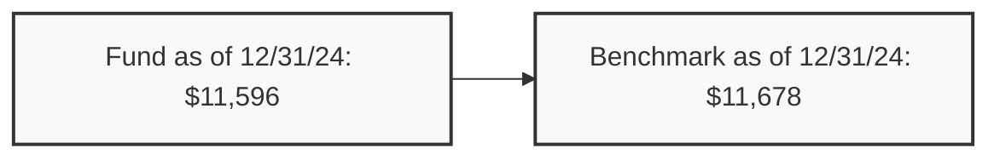

# Parsed Output
## Table of Contents
- [Chunk 0 — p. n/a: Vanguard Short-Term Bond Index Fund](#chunk-0-vanguard-short-term-bond-index-fund)

---

## Chunk 0 — Page n/a

Fact sheet | June 30, 2025

# Vanguard Short-Term Bond Index Fund

Bond fund | Admiral™ Shares

# # Fund facts

<table>
  <tr>
    <th>Risk level</th>
    <th>Total net assets</th>
    <th>Expense ratio as of 04/29/25</th>
    <th>Ticker symbol</th>
    <th>Turnover rate</th>
    <th>Inception date</th>
    <th>Fund number</th>
  </tr>
<tr>
    <td>Low ◼◼◼4◻ High</td>
<td>$11,995 MM</td>
<td>0.06%</td>
<td>VBIRX</td>
<td>55.9%</td>
<td>11/12/01</td>
<td>5132</td>
  </tr>
</table>

# # Investment objective

Vanguard Short-Term Bond Index Fund seeks to track the performance of a market-weighted bond index with a short-term dollar-weighted average maturity.

# # Benchmark

Spl Bloomberg US1-5YrGov/Cr FlAdjIx

# # Growth of a $10,000 investment : January 31, 2015—December 31, 2024

# # Investment strategy

The fund employs an indexing investment approach designed to track the performance of the Bloomberg 1–5 Year U.S. Government/Credit Float Adjusted Bond Index. This index includes all medium and larger issues of U.S. government, investment-grade corporate, and investment-grade international dollar-denominated bonds that have maturities of between 1 and 5 years and are publicly issued. The fund invests by sampling the index, meaning that it holds a range of securities that, in the aggregate, approximates the full index in terms of key risk factors and other characteristics. All of the fund's investments will be selected through the sampling process, and at least 80% of the fund's assets will be invested in bonds held in the index. Under normal circumstances, the fund's dollar-weighted average maturity is not expected to exceed 3 years.

# # Annual returns

<table>
  <tr>
    <th></th>
    <th>2015</th>
    <th>2016</th>
    <th>2017</th>
    <th>2018</th>
    <th>2019</th>
    <th>2020</th>
    <th>2021</th>
    <th>2022</th>
    <th>2023</th>
    <th>2024</th>
  </tr>
<tr>
    <td>Fund</td>
<td>0.92</td>
<td>1.49</td>
<td>1.18</td>
<td>1.35</td>
<td>4.86</td>
<td>4.69</td>
<td>-1.08</td>
<td>-5.54</td>
<td>4.87</td>
<td>3.73</td>
  </tr>
<tr>
    <td>Benchmark</td>
<td>0.97</td>
<td>1.57</td>
<td>1.27</td>
<td>1.38</td>
<td>5.01</td>
<td>4.71</td>
<td>-0.97</td>
<td>-5.50</td>
<td>4.89</td>
<td>3.76</td>
  </tr>
</table>

# # Total returns

Periods ended June 30, 2025

<table>
  <tr>
    <th></th>
    <th>Quarter</th>
    <th>Year to date</th>
    <th>One year</th>
    <th>Three years</th>
    <th>Five years</th>
    <th>Ten years</th>
  </tr>
<tr>
    <td>Fund</td>
<td>1.45%</td>
<td>3.50%</td>
<td>6.29%</td>
<td>3.66%</td>
<td>1.14%</td>
<td>1.85%</td>
  </tr>
<tr>
    <td>Benchmark</td>
<td>1.50%</td>
<td>3.56%</td>
<td>6.42%</td>
<td>3.72%</td>
<td>1.21%</td>
<td>1.92%</td>
  </tr>
</table>

The performance data shown represent past performance, which is not a guarantee of future results. Investment returns and principal value will fluctuate, so investors' shares, when sold, may be worth more or less than their original cost. Current performance may be lower or higher than the performance data cited. For performance data current to the most recent month-end, visit our website at vanguard.com/performance. The performance of an index is not an exact representation of any particular investment, as you cannot invest directly in an index.

Figures for periods of less than one year are cumulative returns. All other figures represent average annual returns. Performance figures include the reinvestment of all dividends and any capital gains distributions. All returns are net of expenses.

# # Distribution by issuer–bonds

<table>
  <tr>
    <th>Category</th>
    <th>Percentage</th>
  </tr>
<tr>
    <td>Treasury/Agency</td>
<td>69.3%</td>
  </tr>
<tr>
    <td>Industrial</td>
<td>12.6%</td>
  </tr>
<tr>
    <td>Finance</td>
<td>11.3%</td>
  </tr>
<tr>
    <td>Foreign</td>
<td>4.8%</td>
  </tr>
<tr>
    <td>Utilities</td>
<td>1.6%</td>
  </tr>
<tr>
    <td>Other</td>
<td>0.4%</td>
  </tr>
</table>

Spl Bloomberg US1-5YrGov/Cr FlAdjIx: Bloomberg U.S. 1–5 Year Government/Credit Bond Index through December 31, 2009; Bloomberg U.S. 1–5 Year Government/Credit Float Adjusted Index thereafter.
# Parsed Output
## Table of Contents
- [Chunk 0 — p. n/a: Vanguard Short-Term Bond Index Fund](#chunk-0-vanguard-short-term-bond-index-fund)

---

## Chunk 0 — Page n/a

Fact sheet | June 30, 2025

# Vanguard Short-Term Bond Index Fund

Bond fund | Admiral™ Shares

# # Distribution by credit quality†

<table>
  <tr>
    <td>U.S. Government</td>
<td>69.3%</td>
<td>A</td>
<td>12.5</td>
  </tr>
<tr>
    <td>Aaa</td>
<td>3.2</td>
<td>Baa</td>
<td>12.0</td>
  </tr>
<tr>
    <td>Aa</td>
<td>2.7</td>
<td>Not Rated</td>
<td>0.3</td>
  </tr>
</table>

# # Connect with Vanguard ® • vanguard.com

## # Plain talk about risk

The fund is designed for investors with a low tolerance for risk; however, the fund's performance could be hurt by:

**Interest rate risk:** The chance that bond prices will decline because of rising interest rates. Interest rate risk should be low for the fund because it invests primarily in short-term bonds, whose prices are much less sensitive to interest rate changes than are the prices of long-term bonds.

**Income risk:** The chance that the fund's income will decline because of falling interest rates.

**Call risk:** The chance that during periods of falling interest rates, issuers of callable bonds may call (redeem) securities with higher coupon rates or interest rates before their maturity dates. The fund would then lose any price appreciation above the bond's call price and would be forced to reinvest the unanticipated proceeds at lower interest rates, resulting in a decline in the fund's income. Such redemptions and subsequent reinvestments would also increase the fund's portfolio turnover rate.

**Credit risk:** The chance that a bond issuer will fail to pay interest or principal in a timely manner or that negative perceptions of the issuer's ability to make such payments will cause the price of that bond to decline. Credit risk should be low for the fund because it purchases only bonds that are of investment-grade quality.

**Index sampling risk:** The chance that the securities selected for the fund, in the aggregate, will not provide investment performance matching that of the index. Index sampling risk for the fund should be low.

**Index-related risks:** The fund is subject to risks associated with index investing, which include passive management risk, tracking error risk, and index provider risk. Passive management risk is the chance that the fund's use of an indexing strategy will negatively impact the fund's performance. Because the fund seeks to track the performance of its target index regardless of how that index is performing, the fund's performance may be lower than it would be if the fund were actively managed. Tracking error risk is the chance that the fund's performance will deviate from the performance of its target index. Tracking error risk may be heightened during times of increased market volatility or under other unusual market conditions. Index provider risk is the chance that the fund will be negatively impacted by changes or errors made by the index provider. Any gains, losses, or costs associated with or resulting from an error made by the index provider will generally be borne by the fund and, as a result, the fund's shareholders.

**Liquidity risk:** The chance that the fund may not be able to sell a security in a timely manner at a desired price.

†Credit-quality ratings are measured on a scale that generally ranges from AAA (highest) to D (lowest). "NR" is used to classify securities for which a rating is not available. NR securities may include internal money market funds, derivatives, and futures. U.S. Treasury, U.S. agency, and U.S. agency mortgage-backed securities appear under "U.S. Government." Credit-quality ratings for each issue are either obtained from Bloomberg using ratings derived from Moody's Investors Service (Moody's), Fitch Ratings (Fitch), and Standard & Poor's (S&P), or directly from Moody's and S&P. Credit-quality ratings obtained from Bloomberg use the following methodologies: When ratings from all three agencies are available, the median rating is used; when ratings from only two of the agencies are available, the lower rating is used; and when one rating is available, that rating is used. Credit-quality ratings obtained directly from Moody's and S&P use the higher rating for each issue.

"Bloomberg®" is a service mark of Bloomberg Finance L.P. and its affiliates, including Bloomberg Index Services Limited ("BISL"), the administrator of the index (collectively, "Bloomberg") and have been licensed for use for certain purposes by Vanguard. Bloomberg is not affiliated with Vanguard, and Bloomberg does not approve, endorse, review, or recommend the products. Bloomberg does not guarantee the timeliness, accurateness, or completeness of any data or information relating to the products.

For more information about Vanguard funds or to obtain a prospectus, see below for which situation is right for you.

If you receive your retirement plan statement from Vanguard or log on to Vanguard's website to view your plan, visit vanguard.com or call 800-523-1188.

If you receive your retirement plan statement from a service provider other than Vanguard or log on to a recordkeeper's website that is not Vanguard to view your plan, please call 855-402-2646.

Visit vanguard.com to obtain a prospectus or, if available, a summary prospectus. Investment objectives, risks, charges, expenses, and other important information about a fund are contained in the prospectus; read and consider it carefully before investing.

Financial advisor clients: For more information about Vanguard funds, contact your financial advisor to obtain a prospectus.

Investment Products: Not FDIC Insured • No Bank Guarantee • May Lose Value

© 2025 The Vanguard Group, Inc. All rights reserved. Vanguard Marketing Corporation, Distributor. F5132 062025
