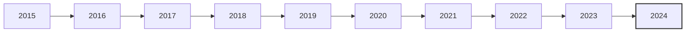

# Parsed Output
## Table of Contents
- [Chunk 0 — p. n/a: Vanguard Small-Cap Value Index Fund](#chunk-0-vanguard-small-cap-value-index-fund)

---

## Chunk 0 — Page n/a

Fact sheet | June 30, 2025

# Vanguard Small-Cap Value Index Fund

Domestic stock fund | Admiral™ Shares

# # Fund facts

<table>
<tr>
<th>Risk level</th>
<th>Total net assets</th>
<th>Expense ratio as of 04/29/25</th>
<th>Ticker symbol</th>
<th>Turnover rate</th>
<th>Inception date</th>
<th>Fund number</th>
</tr>
<tr>
<td>Low 5 High 1 2 3 4 5</td>
<td>$19,984 MM</td>
<td>0.07%</td>
<td>VSIAX</td>
<td>15.8%</td>
<td>09/27/11</td>
<td>5860</td>
</tr>
</table>

# # Investment objective

Vanguard Small-Cap Value Index Fund seeks to track the performance of a benchmark index that measures the investment return of small-capitalization value stocks.

# # Benchmark

Spliced Small Cap Value Index

# # Investment strategy

The fund employs an indexing investment approach designed to track the performance of the the CRSP US Small Cap Value Index, a broadly diversified index of value stocks of smaller U.S. companies. The fund attempts to replicate the target index by investing all, or substantially all, of its assets in the stocks that make up the index, holding each stock in approximately the same proportion as its weighting in the index.

# # Growth of a $10,000 investment : January 31, 2015—December 31, 2024

$23,757 Fund as of 12/31/24
$23,752 Benchmark as of 12/31/24

# # Annual returns

<table>
<thead>
<tr>
<th></th>
<th>2015</th>
<th>2016</th>
<th>2017</th>
<th>2018</th>
<th>2019</th>
<th>2020</th>
<th>2021</th>
<th>2022</th>
<th>2023</th>
<th>2024</th>
</tr>
</thead>
<tbody>
<tr>
<td>Fund</td>
<td>-4.65</td>
<td>24.78</td>
<td>11.80</td>
<td>-12.23</td>
<td>22.76</td>
<td>5.85</td>
<td>28.09</td>
<td>-9.31</td>
<td>15.99</td>
<td>12.39</td>
</tr>
<tr>
<td>Benchmark</td>
<td>-4.64</td>
<td>24.82</td>
<td>11.83</td>
<td>-12.27</td>
<td>22.76</td>
<td>5.75</td>
<td>28.15</td>
<td>-9.27</td>
<td>15.91</td>
<td>12.42</td>
</tr>
</tbody>
</table>

# # Total returns

Periods ended June 30, 2025

<table>
<thead>
<tr>
<th></th>
<th>Quarter</th>
<th>Year to date</th>
<th>One year</th>
<th>Three years</th>
<th>Five years</th>
<th>Ten years</th>
</tr>
</thead>
<tbody>
<tr>
<td>Fund</td>
<td>5.20%</td>
<td>-0.51%</td>
<td>9.12%</td>
<td>11.65%</td>
<td>15.18%</td>
<td>8.39%</td>
</tr>
<tr>
<td>Benchmark</td>
<td>5.21%</td>
<td>-0.50%</td>
<td>9.15%</td>
<td>11.64%</td>
<td>15.18%</td>
<td>8.39%</td>
</tr>
</tbody>
</table>

The performance data shown represent past performance, which is not a guarantee of future results. Investment returns and principal value will fluctuate, so investors' shares, when sold, may be worth more or less than their original cost. Current performance may be lower or higher than the performance data cited. For performance data current to the most recent month-end, visit our website at vanguard.com/performance. The performance of an index is not an exact representation of any particular investment, as you cannot invest directly in an index.

Figures for periods of less than one year are cumulative returns. All other figures represent average annual returns. Performance figures include the reinvestment of all dividends and any capital gains distributions. All returns are net of expenses.

Spliced Small Cap Value Index: S&P SmallCap 600 Value Index (formerly known as the S&P SmallCap 600/Barra Value Index) through May 16, 2003; MSCI US Small Cap Value Index through April 16, 2013; CRSP US Small Cap Value Index thereafter.

F5860 062025
# Parsed Output
## Table of Contents
- [Chunk 0 — p. n/a: Vanguard Small-Cap Value Index Fund](#chunk-0-vanguard-small-cap-value-index-fund)

---

## Chunk 0 — Page n/a

Fact sheet | June 30, 2025

# Vanguard Small-Cap Value Index Fund

Domestic stock fund | Admiral™ Shares

# # Ten largest holdings*

1. NRG Energy Inc.
2. EMCOR Group Inc.
3. Atmos Energy Corp.
4. Smurfit WestRock plc
5. Jabil Inc.
6. Williams-Sonoma Inc.
7. Tapestry Inc.
8. First Citizens BancShares Inc.
9. US Foods Holding Corp.
10. Equitable Holdings Inc.

Top 10 as % of total net assets: 6.1%

\* The holdings listed exclude any temporary cash investments and equity index products.

# # Sector Diversification

<table>
  <tr>
    <td>Industrials</td>
<td>22.1%</td>
<td>Utilities</td>
<td>5.9</td>
  </tr>
<tr>
    <td>Financials</td>
<td>21.1</td>
<td>Basic Materials</td>
<td>4.7</td>
  </tr>
<tr>
    <td>Consumer Discretionary</td>
<td>14.4</td>
<td>Consumer Staples</td>
<td>3.6</td>
  </tr>
<tr>
    <td>Real Estate</td>
<td>8.6</td>
<td>Energy</td>
<td>3.6</td>
  </tr>
<tr>
    <td>Health Care</td>
<td>7.7</td>
<td>Telecommunications</td>
<td>1.3</td>
  </tr>
<tr>
    <td>Technology</td>
<td>7.0</td>
<td>Other</td>
<td>0.0</td>
  </tr>
</table>

Sector categories are based on the Industry Classification Benchmark system ("ICB"), except for the "Other" category (if applicable), which includes securities that have not been provided an ICB classification as of the effective reporting period.

# # Connect with Vanguard® • vanguard.com

## # Plain talk about risk

An investment in the fund could lose money over short or even long periods. You should expect the fund's share price and total return to fluctuate within a wide range, like the fluctuations of the overall stock market. The fund's performance could be hurt by:

**Stock market risk:** The chance that stock prices overall will decline. Stock markets tend to move in cycles, with periods of rising stock prices and periods of falling stock prices. The fund's target index tracks a subset of the U.S. stock market, which could cause the fund to perform differently from the overall stock market. In addition, the fund's target index may, at times, become focused in stocks of a particular market sector, which would subject the fund to proportionately higher exposure to the risks of that sector.

**Investment style risk:** The chance that returns from small-capitalization value stocks will trail returns from the overall stock market. Historically, small-cap stocks have been more volatile in price than the large-cap stocks that dominate the overall market, and they often perform quite differently. The stock prices of small companies tend to experience greater volatility because, among other things, these companies tend to be more sensitive to changing economic conditions.

**Index-related risks:** The fund is subject to risks associated with index investing, which include passive management risk, tracking error risk, and index provider risk. Passive management risk is the chance that the fund's use of an indexing strategy will negatively impact the fund's performance. Because the fund seeks to track the performance of its target index regardless of how that index is performing, the fund's performance may be lower than it would be if the fund were actively managed. Tracking error risk is the chance that the fund's performance will deviate from the performance of its target index. Tracking error risk may be heightened during times of increased market volatility or under other unusual market conditions. Index provider risk is the chance that the fund will be negatively impacted by changes or errors made by the index provider. Any gains, losses, or costs associated with or resulting from an error made by the index provider will generally be borne by the fund and, as a result, the fund's shareholders.

**Index replicating risk:** The chance that the fund may be prevented from holding one or more securities in the same proportion as in its target index.

## # Note on frequent trading restrictions

Frequent trading policies may apply to those funds offered as investment options within your plan. Please log on to vanguard.com for your employer plans or contact Participant Services at 800-523-1188 for additional information.

Center for Research in Security Prices, LLC (CRSP®) and its third-party suppliers have exclusive proprietary rights in the CRSP® Index Data, which has been licensed for use by Vanguard but is and shall remain valuable intellectual property owned by, and/or licensed to, CRSP®. The Vanguard Funds are not sponsored, endorsed, sold or promoted by CRSP®, The University of Chicago, or The University of Chicago Booth School of Business and neither CRSP®, The University of Chicago, or The University of Chicago Booth School of Business, make any representation regarding the advisability of investing in the Vanguard Funds.

For more information about Vanguard funds or to obtain a prospectus, see below for which situation is right for you.

If you receive your retirement plan statement from Vanguard or log on to Vanguard's website to view your plan, visit vanguard.com or call 800-523-1188.

If you receive your retirement plan statement from a service provider other than Vanguard or log on to a recordkeeper's website that is not Vanguard to view your plan, please call 855-402-2646.

Visit vanguard.com to obtain a prospectus or, if available, a summary prospectus. Investment objectives, risks, charges, expenses, and other important information about a fund are contained in the prospectus; read and consider it carefully before investing.

Financial advisor clients: For more information about Vanguard funds, contact your financial advisor to obtain a prospectus.

Investment Products: Not FDIC Insured • No Bank Guarantee • May Lose Value

© 2025 The Vanguard Group, Inc. All rights reserved. Vanguard Marketing Corporation, Distributor. F5860 062025
