# Parsed Output
## Table of Contents
- [Chunk 0 — p. n/a: Vanguard Tax-Exempt Bond Index Fund](#chunk-0-vanguard-tax-exempt-bond-index-fund)

---

## Chunk 0 — Page n/a

Fact sheet | June 30, 2025

Vanguard®

# Vanguard Tax-Exempt Bond Index Fund

Bond fund | Admiral™ Shares

# # Fund facts

<table>
<tr>
<th>Risk level Low                          High</th>
<th>Total net assets</th>
<th>Expense ratio as of 02/28/25</th>
<th>Ticker symbol</th>
<th>Turnover rate</th>
<th>Inception date</th>
<th>Fund number</th>
</tr>
<tr>
<td>1     2     3     4     5</td>
<td>$2,503 MM</td>
<td>0.07%</td>
<td>VTEAX</td>
<td>19.3%</td>
<td>08/25/15</td>
<td>0591</td>
</tr>
</table>

# # Investment objective

Vanguard Tax-Exempt Bond Index Fund seeks to track the performance of a benchmark index that measures the investment-grade segment of the U.S. municipal bond market.

# # Benchmark

S&P National AMT-Free Muni Bond Idx

# # Growth of a $10,000 investment : August 31, 2015—December 31, 2024

```mermaid
graph LR
    A[2015*] --> B[2016] --> C[2017] --> D[2018] --> E[2019] --> F[2020] --> G[2021] --> H[2022] --> I[2023] --> J[2024]
    style A fill:#f9f9f9,stroke:#333,stroke-width:1px
    style B fill:#f9f9f9,stroke:#333,stroke-width:1px
    style C fill:#f9f9f9,stroke:#333,stroke-width:1px
    style D fill:#f9f9f9,stroke:#333,stroke-width:1px
    style E fill:#f9f9f9,stroke:#333,stroke-width:1px
    style F fill:#f9f9f9,stroke:#333,stroke-width:1px
    style G fill:#f9f9f9,stroke:#333,stroke-width:1px
    style H fill:#f9f9f9,stroke:#333,stroke-width:1px
    style I fill:#f9f9f9,stroke:#333,stroke-width:1px
    style J fill:#f9f9f9,stroke:#333,stroke-width:1px
```

$12,304 Fund as of 12/31/24
$12,355 Benchmark as of 12/31/24

# # Investment strategy

The fund employs an indexing investment approach designed to track the performance of the S&P National AMT-Free Municipal Bond Index, which measures the performance of the investment-grade segment of the U.S. municipal bond market. The index includes municipal bonds from issuers that are primarily state or local governments or agencies whose interest is exempt from U.S. federal income taxes and the federal alternative minimum tax (AMT). To be eligible for inclusion in the index, each bond must have a rating of at least investment-grade, as determined by a nationally recognized statistical rating organization (e.g., at least BBB- by Fitch Ratings, Inc.); be denominated in U.S. dollars; and have a minimum par amount of $25 million. In addition, to be included in the index, each bond must have a minimum term to maturity and/or pre-funded or call date greater than one calendar month. The fund invests by sampling the index, meaning that it holds a range of securities that, in the aggregate, approximate the full index in terms of key risk factors and other characteristics. All of the fund's investments will be selected through the sampling process, and at least 80% of the fund's assets will be invested in bonds held in the index. Under normal circumstances, at least 80% of the fund's income will be exempt from federal income taxes.

# # Annual returns

<table>
<thead>
<tr>
<th>Annual returns</th>
<th>2015*</th>
<th>2016</th>
<th>2017</th>
<th>2018</th>
<th>2019</th>
<th>2020</th>
<th>2021</th>
<th>2022</th>
<th>2023</th>
<th>2024</th>
</tr>
</thead>
<tbody>
<tr>
<td>Fund</td>
<td>2.31</td>
<td>0.33</td>
<td>4.99</td>
<td>0.94</td>
<td>7.45</td>
<td>4.98</td>
<td>1.43</td>
<td>-8.22</td>
<td>6.15</td>
<td>1.36</td>
</tr>
<tr>
<td>Benchmark</td>
<td>2.24</td>
<td>0.36</td>
<td>5.09</td>
<td>1.01</td>
<td>7.42</td>
<td>4.95</td>
<td>1.59</td>
<td>-8.10</td>
<td>6.24</td>
<td>1.32</td>
</tr>
</tbody>
</table>

# # Total returns

Periods ended June 30, 2025

<table>
<thead>
<tr>
<th>Total returns</th>
<th>Quarter</th>
<th>Year to date</th>
<th>One year</th>
<th>Three years</th>
<th>Five years</th>
<th>Since inception</th>
</tr>
</thead>
<tbody>
<tr>
<td>Fund</td>
<td>-0.19%</td>
<td>-0.85%</td>
<td>0.75%</td>
<td>2.32%</td>
<td>0.43%</td>
<td>2.03%</td>
</tr>
<tr>
<td>Benchmark</td>
<td>-0.15%</td>
<td>-0.78%</td>
<td>0.79%</td>
<td>2.38%</td>
<td>0.51%</td>
<td>—</td>
</tr>
</tbody>
</table>

The performance data shown represent past performance, which is not a guarantee of future results. Investment returns and principal value will fluctuate, so investors' shares, when sold, may be worth more or less than their original cost. Current performance may be lower or higher than the performance data cited. For performance data current to the most recent month-end, visit our website at vanguard.com/performance. The performance of an index is not an exact representation of any particular investment, as you cannot invest directly in an index.
Figures for periods of less than one year are cumulative returns. All other figures represent average annual returns. Performance figures include the reinvestment of all dividends and any capital gains distributions. All returns are net of expenses.

# # Largest state concentrations

<table>
<tr>
<td>New York</td>
<td>24.0%</td>
<td>Massachusetts</td>
<td>4.5</td>
</tr>
<tr>
<td>California</td>
<td>16.9</td>
<td>Pennsylvania</td>
<td>3.5</td>
</tr>
<tr>
<td>Texas</td>
<td>10.7</td>
<td>Florida</td>
<td>3.1</td>
</tr>
<tr>
<td>Illinois</td>
<td>5.5</td>
<td>Washington</td>
<td>3.0</td>
</tr>
<tr>
<td>New Jersey</td>
<td>4.6</td>
<td>Connecticut</td>
<td>2.0</td>
</tr>
</table>

* Partial return since fund started, August 25, 2015.
S&P National AMT-Free Muni Bond Idx: A broad, market value-weighted index designed to measure the performance of the investment-grade tax-exempt U.S. municipal bond market. Bonds issued by U.S. territories, including Puerto Rico, are excluded from the index.
# Parsed Output
## Table of Contents
- [Chunk 0 — p. n/a: Vanguard Tax-Exempt Bond Index Fund](#chunk-0-vanguard-tax-exempt-bond-index-fund)

---

## Chunk 0 — Page n/a

Fact sheet | June 30, 2025

# Vanguard Tax-Exempt Bond Index Fund

Bond fund | Admiral™ Shares

# # Distribution by credit quality†

<table>
  <tr>
    <td>AAA</td>
<td>18.2%</td>
<td>BBB</td>
<td>2.0</td>
  </tr>
<tr>
    <td>AA</td>
<td>61.1</td>
<td>Not Rated</td>
<td>0.9</td>
  </tr>
<tr>
    <td>A</td>
<td>17.8</td>
<td></td>
<td></td>
  </tr>
</table>

# # Connect with Vanguard ® • vanguard.com

## # Plain talk about risk

An investment in the fund could lose money over short or even long periods. You should expect the fund's share price and total return to fluctuate within a wide range, like the fluctuations of the overall bond market. The fund's performance could be hurt by:

**Interest rate risk**: The chance that bond prices will decline because of rising interest rates.

**Income risk**: The chance that the fund's income will decline because of falling interest rates.

**Call risk**: The chance that during periods of falling interest rates, issuers of callable bonds may call (redeem) securities with higher coupon rates or interest rates before their maturity dates. The fund would then lose any price appreciation above the bond's call price and would be forced to reinvest the unanticipated proceeds at lower interest rates, resulting in a decline in the fund's income. Such redemptions and subsequent reinvestments would also increase the fund's portfolio turnover rate.

**Extension risk**: The chance that during periods of rising interest rate rates, certain debt obligations will be paid off substantially more slowly than originally anticipated and the value of those securities may fall.

**Credit risk**: The chance that a bond issuer will fail to pay interest or principal in a timely manner, or that negative perceptions of the issuer's ability to make such payments will cause the price of that bond to decline. In general, credit risk is expected to be relatively low for the fund because it invests primarily in bonds that are considered to be of high quality.

**Index sampling risk**: The chance that the securities selected for the fund, in the aggregate, will not provide investment performance matching that of the index. Index sampling risk for the fund should be low.

**Index-related risks**: The fund is subject to risks associated with index investing, which include passive management risk, tracking error risk, and index provider risk. Passive management risk is the chance that the fund's use of an indexing strategy will negatively impact the fund's performance. Because the fund seeks to track the performance of its target index regardless of how that index is performing, the fund's performance may be lower than it would be if the fund were actively managed. Tracking error risk is the chance that the fund's performance will deviate from the performance of its target index. Tracking error risk may be heightened during times of increased market volatility or under other unusual market conditions. Index provider risk is the chance that the fund will be negatively impacted by changes or errors made by the index provider. Any gains, losses, or costs associated with or resulting from an error made by the index provider will generally be borne by the fund and, as a result, the fund's shareholders.

**Liquidity risk**: The chance that the fund may not be able to sell a security in a timely manner at a desired price.

**Tax risk**: The chance that all or a portion of the tax-exempt income from municipal bonds held by the fund will be declared taxable, possibly with retroactive effect, because of unfavorable changes in tax laws, adverse interpretations by the Internal Revenue Service or state or local tax authorities, or noncompliant conduct of a bond issuer.

**Regional risk**: The chance that economic, political, or regulatory occurrences within a certain state may adversely affect the value of securities offered by issuers located within that state. Because the fund may invest a large portion of its assets in securities located in any one state, the fund's performance may be hurt disproportionately by the poor performance of its investments in that area.

**Nondiversification risk**: Because the fund seeks to closely track the composition of the fund's target index, from time to time, more than 25% of the fund's total assets may be invested in issuers representing more than 5% of the fund's total assets due to an index rebalance or market movement, which would result in the fund being nondiversified under the Investment Company Act of 1940. The fund's performance may be hurt disproportionately by the poor performance of bonds issued by just a few issuers or even a single issuer, and the fund's shares may experience significant fluctuations in value.

## # Note on frequent trading restrictions

Frequent trading policies may apply to those funds offered as investment options within your plan. Please log on to vanguard.com for your employer plans or contact Participant Services at 800-523-1188 for additional information.

Although the income from a municipal bond fund is exempt from federal tax, you may owe taxes on any capital gains realized through the fund's trading or through your own redemption of shares. For some investors, a portion of the fund's income may be subject to state and local taxes, as well as to the federal Alternative Minimum Tax.

†Credit-quality ratings are measured on a scale that generally ranges from AAA (highest) to D (lowest). "NR" is used to classify securities for which a rating is not available. NR securities may include internal money market funds, derivatives, and futures. U.S. Treasury, U.S. agency, and U.S. agency mortgage-backed securities appear under "U.S. Government." Credit-quality ratings for each issue are either obtained from Bloomberg using ratings derived from Moody's Investors Service (Moody's), Fitch Ratings (Fitch), and Standard & Poor's (S&P), or directly from Moody's and S&P. Credit-quality ratings obtained from Bloomberg use the following methodologies: When ratings from all three agencies are available, the median rating is used; when ratings from only two of the agencies are available, the lower rating is used; and when one rating is available, that rating is used. Credit-quality ratings obtained directly from Moody's and S&P use the higher rating for each issue.

The index is a product of S&P Dow Jones Indices LLC, a division of S&P Global, or its affiliates ("SPDJI"), and has been licensed for use by Vanguard. Standard & Poor's® and S&P® are registered trademarks of Standard & Poor's Financial Services LLC, a division of S&P Global ("S&P"); Dow Jones® is a registered trademark of Dow Jones Trademark Holdings LLC ("Dow Jones"); and these trademarks have been licensed for use by SPDJI and sublicensed for certain purposes by Vanguard. Vanguard products are not sponsored, endorsed, sold or promoted by SPDJI, Dow Jones, S&P, or their respective affiliates and none of such parties make any representation regarding the advisability of investing in such product(s) nor do they have any liability for any errors, omissions, or interruptions of the index.

For more information about Vanguard funds or to obtain a prospectus, see below for which situation is right for you.

If you receive your retirement plan statement from Vanguard or log on to Vanguard's website to view your plan, visit vanguard.com or call 800-523-1188.

If you receive your retirement plan statement from a service provider other than Vanguard or log on to a recordkeeper's website that is not Vanguard to view your plan, please call 855-402-2646.

Visit vanguard.com to obtain a prospectus or, if available, a summary prospectus. Investment objectives, risks, charges, expenses, and other important information about a fund are contained in the prospectus; read and consider it carefully before investing.

Financial advisor clients: For more information about Vanguard funds, contact your financial advisor to obtain a prospectus.

Investment Products: Not FDIC Insured • No Bank Guarantee • May Lose Value

© 2025 The Vanguard Group, Inc. All rights reserved. Vanguard Marketing Corporation, Distributor. F0591 062025
