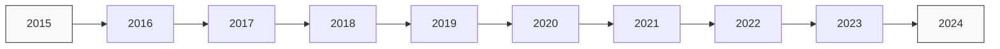

# Parsed Output
## Table of Contents
- [Chunk 0 — p. n/a: Vanguard U.S. Growth Fund](#chunk-0-vanguard-us-growth-fund)

---

## Chunk 0 — Page n/a

Fact sheet | June 30, 2025

Vanguard logo

# Vanguard U.S. Growth Fund

Domestic stock fund | Admiral™ Shares

# # Fund facts

<table>
  <tr>
    <th>Risk level</th>
    <th>Total net assets</th>
    <th>Expense ratio as of 12/20/24</th>
    <th>Ticker symbol</th>
    <th>Turnover rate</th>
    <th>Inception date</th>
    <th>Fund number</th>
  </tr>
<tr>
    <td>Low 1 2 3 4 5 High</td>
<td>$38,343 MM</td>
<td>0.22%</td>
<td>VWUAX</td>
<td>36.6%</td>
<td>08/13/01</td>
<td>0523</td>
  </tr>
</table>

# # Investment objective

Vanguard U.S. Growth Fund seeks to provide long-term capital appreciation.

# # Benchmark

Russell 1000 Growth Index

# # Investment strategy

The fund invests mainly in large-capitalization stocks of U.S. companies considered to have above-average earnings growth potential and reasonable stock prices in comparison with expected earnings. The fund uses multiple investment advisors.

# # Growth of a $10,000 investment : January 31, 2015—December 31, 2024

- $40,128 Fund as of 12/31/24
- $47,885 Benchmark as of 12/31/24

# # Annual returns

<table>
  <tr>
    <th></th>
    <th>2015</th>
    <th>2016</th>
    <th>2017</th>
    <th>2018</th>
    <th>2019</th>
    <th>2020</th>
    <th>2021</th>
    <th>2022</th>
    <th>2023</th>
    <th>2024</th>
  </tr>
<tr>
    <td>Fund</td>
<td>8.61</td>
<td>-0.59</td>
<td>31.74</td>
<td>0.75</td>
<td>33.51</td>
<td>58.74</td>
<td>12.45</td>
<td>-39.58</td>
<td>45.31</td>
<td>32.03</td>
  </tr>
<tr>
    <td>Benchmark</td>
<td>5.67</td>
<td>7.08</td>
<td>30.21</td>
<td>-1.51</td>
<td>36.39</td>
<td>38.49</td>
<td>27.60</td>
<td>-29.14</td>
<td>42.68</td>
<td>33.36</td>
  </tr>
</table>

# # Total returns

Periods ended June 30, 2025

<table>
  <tr>
    <th></th>
    <th>Quarter</th>
    <th>Year to date</th>
    <th>One year</th>
    <th>Three years</th>
    <th>Five years</th>
    <th>Ten years</th>
  </tr>
<tr>
    <td>Fund</td>
<td>20.77%</td>
<td>8.46%</td>
<td>20.26%</td>
<td>26.69%</td>
<td>13.44%</td>
<td>15.01%</td>
  </tr>
<tr>
    <td>Benchmark</td>
<td>17.84%</td>
<td>6.09%</td>
<td>17.22%</td>
<td>25.76%</td>
<td>18.15%</td>
<td>17.01%</td>
  </tr>
</table>

The performance data shown represent past performance, which is not a guarantee of future results. Investment returns and principal value will fluctuate, so investors' shares, when sold, may be worth more or less than their original cost. Current performance may be lower or higher than the performance data cited. For performance data current to the most recent month-end, visit our website at vanguard.com/performance. The performance of an index is not an exact representation of any particular investment, as you cannot invest directly in an index.

Figures for periods of less than one year are cumulative returns. All other figures represent average annual returns. Performance figures include the reinvestment of all dividends and any capital gains distributions. All returns are net of expenses.

Russell 1000 Growth Index: Measures the performance of those Russell 1000 companies with higher price/book ratios, higher predicted and historical growth rates.
# Parsed Output
## Table of Contents
- [Chunk 0 — p. n/a: Vanguard U.S. Growth Fund](#chunk-0-vanguard-us-growth-fund)

---

## Chunk 0 — Page n/a

Fact sheet | June 30, 2025

# Vanguard U.S. Growth Fund

Domestic stock fund | Admiral™ Shares

# # Ten largest holdings*

1. NVIDIA Corp.
2. Microsoft Corp.
3. Amazon.com Inc.
4. Apple Inc.
5. Meta Platforms Inc.
6. Netflix Inc.
7. Broadcom Inc.
8. Alphabet Inc.
9. Mastercard Inc.
10. Eli Lilly & Co.

Top 10 as % of total net assets: 55.5%

\* The holdings listed exclude any temporary cash investments and equity index products.

# # Sector Diversification

<table>
<tr>
<td>Information Tech</td>
<td>42.4%</td>
<td>Consumer Staples</td>
<td>1.6</td>
</tr>
<tr>
<td>Communication Services</td>
<td>17.8</td>
<td>Real Estate</td>
<td>1.3</td>
</tr>
<tr>
<td>Consumer Discretionary</td>
<td>16.3</td>
<td>Utilities</td>
<td>0.4</td>
</tr>
<tr>
<td>Financials</td>
<td>7.7</td>
<td>Energy</td>
<td>0.0</td>
</tr>
<tr>
<td>Health Care</td>
<td>7.5</td>
<td>Materials</td>
<td>0.0</td>
</tr>
<tr>
<td>Industrials</td>
<td>5.0</td>
<td>Other</td>
<td>0.0</td>
</tr>
</table>

Sector categories are based on the Global Industry Classification Standard ("GICS"), except for the "Other" category (if applicable), which includes securities that have not been provided a GICS classification as of the effective reporting period.

# # Connect with Vanguard® • vanguard.com

## # Plain talk about risk

An investment in the fund could lose money over short or long periods of time. You should expect the fund's share price and total return to fluctuate within a wide range. The fund is subject to the following risks, which could affect the fund's performance:

**Stock market risk**, which is the chance that stock prices overall will decline. Stock markets tend to move in cycles, with periods of rising prices and periods of falling prices.

**Investment style risk**, which is the chance that returns from large-capitalization growth stocks in which the fund invests will trail returns from the overall stock market. Large-cap growth stocks tend to go through cycles of doing better—or worse—than other segments of the stock market or the stock market in general. These periods have, in the past, lasted for as long as several years.

**Asset concentration risk**, which is the chance that, because the fund tends to invest a high percentage of assets in its ten largest holdings, the fund's performance may be hurt disproportionately by the poor performance of relatively few stocks.

**Manager risk**, which is the chance that poor security selection will cause the fund to underperform relevant benchmarks or other funds with a similar investment objective. In addition, significant investment in the information technology sector subjects the fund to proportionately higher exposure to the risks of this sector.

**Nondiversification risk**, which is the chance that the fund's performance may be hurt disproportionately by the poor performance of relatively few stocks or even a single stock. The fund is considered nondiversified, which means that it may invest a greater percentage of its assets in the securities of particular issuers as compared with diversified mutual funds.

## # Note on frequent trading restrictions

Frequent trading policies may apply to those funds offered as investment options within your plan. Please log on to vanguard.com for your employer plans or contact Participant Services at 800-523-1188 for additional information.

## # For more information about Vanguard funds or to obtain a prospectus, see below for which situation is right for you.

If you receive your retirement plan statement from Vanguard or log on to Vanguard's website to view your plan, visit vanguard.com or call 800-523-1188.

If you receive your retirement plan statement from a service provider other than Vanguard or log on to a recordkeeper's website that is not Vanguard to view your plan, please call 855-402-2646.

Visit vanguard.com to obtain a prospectus or, if available, a summary prospectus. Investment objectives, risks, charges, expenses, and other important information about a fund are contained in the prospectus; read and consider it carefully before investing.

Financial advisor clients: For more information about Vanguard funds, contact your financial advisor to obtain a prospectus.

Investment Products: Not FDIC Insured • No Bank Guarantee • May Lose Value

© 2025 The Vanguard Group, Inc. All rights reserved. Vanguard Marketing Corporation, Distributor. F0523 062025
