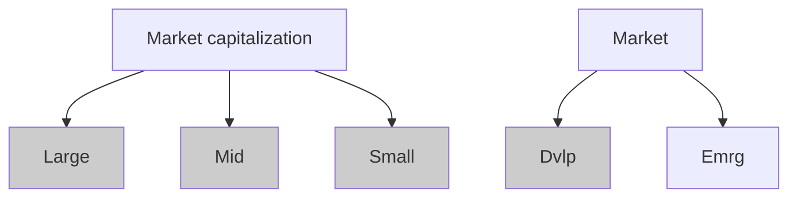

# Vanguard FTSE Developed Markets ETF | VEA

As of June 30, 2025

# # Investment approach

- Seeks to track FTSE Developed All Cap ex US Index.
- International equity diversified across growth and value styles.
- Developed markets in Canada and the major markets of Europe and the Pacific region.
- Passively managed, full-replication approach.
- Fund remains fully invested.
- Low expenses minimize net tracking error.

# # Investment focus

- Central tendency: Dot in the Large/Dvlp quadrant
- Expected range of fund holdings: Shaded area covering Large to Small in Dvlp column

# # About the benchmark

- The FTSE Developed All Cap ex US Index is a market-capitalization-weighted index that is made up of approximately 3,700 common stocks of large-, mid-, and small-cap companies located in Canada and the major markets of Europe and the Pacific region.
- The top countries represented include Japan, United Kingdom, Canada, France, Germany, Switzerland, and Australia.

# # Performance history

Total returns² for period ended June 30, 2025

<table>
  <thead>
    <tr>
      <th>VEA (Inception 2007-07-20)</th>
      <th>Quarter</th>
      <th>Year to date</th>
      <th>1 year</th>
      <th>3 years</th>
      <th>5 years</th>
      <th>10 years</th>
      <th>Since inception</th>
    </tr>
  </thead>
  <tbody>
    <tr>
      <td>Net asset value (NAV) return³</td>
<td>13.10%</td>
<td>20.81%</td>
<td>19.27%</td>
<td>15.42%</td>
<td>11.33%</td>
<td>6.81%</td>
<td>3.86%</td>
    </tr>
<tr>
      <td>Market price return⁴</td>
<td>13.06</td>
<td>20.73</td>
<td>18.94</td>
<td>15.30</td>
<td>11.37</td>
<td>6.82</td>
<td>3.84</td>
    </tr>
<tr>
      <td>Spliced Developed ex US Index</td>
<td>13.38</td>
<td>19.99</td>
<td>18.88</td>
<td>15.43</td>
<td>11.32</td>
<td>6.76</td>
<td>3.73</td>
    </tr>
  </tbody>
</table>

MSCI EAFE Index through May 28, 2013; FTSE Developed ex North America Index through December 20, 2015; FTSE Developed All Cap ex US Transition Index through May 31, 2016; FTSE Developed All Cap ex US Index thereafter. Benchmark returns are adjusted for withholding taxes.

The performance data shown represent past performance, which is not a guarantee of future results. Investment returns and principal value will fluctuate, so investors' shares, when sold, may be worth more or less than their original cost. Current performance may be lower or higher than the performance data cited. For performance data current to the most recent month-end, visit our website at vanguard.com/performance. The performance of an index is not an exact representation of any particular investment, as you cannot invest directly in an index.

# # Quick facts

<table>
  <tr><td>Benchmark</td><td>FTSE Developed All Cap ex US Index</td></tr>
<tr><td>Expense ratio¹</td><td>0.03%</td></tr>
<tr><td>Dividend schedule</td><td>Quarterly</td></tr>
<tr><td>ETF total net assets</td><td>$163,781 million</td></tr>
<tr><td>Fund total net assets</td><td>$232,162 million</td></tr>
<tr><td>Inception date</td><td>2007-07-20</td></tr>
</table>

# # Trading information

<table>
  <tr><td>Ticker symbol</td><td>VEA</td></tr>
<tr><td>CUSIP number</td><td>921943858</td></tr>
<tr><td>IIV (intra-day ticker)</td><td>VEA.IV</td></tr>
<tr><td>Index ticker (Bloomberg)</td><td>ACDXUSR</td></tr>
<tr><td>Exchange</td><td>NYSE Arca</td></tr>
</table>

# # ETF attributes

<table>
  <thead>
    <tr>
      <th></th>
      <th>FTSE Developed Markets ETF</th>
      <th>FTSE Developed All Cap ex US Index</th>
    </tr>
  </thead>
  <tbody>
    <tr><td>Number of stocks</td><td>3,837</td><td>3,769</td></tr>
<tr><td>Median market cap</td><td>$47.9B</td><td>$48.2B</td></tr>
<tr><td>Price/earnings ratio</td><td>16.2x</td><td>16.2x</td></tr>
<tr><td>Price/book ratio</td><td>1.8x</td><td>1.8x</td></tr>
<tr><td>Return on equity</td><td>11.8%</td><td>11.8%</td></tr>
<tr><td>Earnings growth rate</td><td>14.2%</td><td>14.2%</td></tr>
<tr><td>Turnover rate⁵</td><td>2.9</td><td>—</td></tr>
<tr><td>Standard deviation⁶</td><td>16.63%</td><td>15.66%</td></tr>
  </tbody>
</table>

Investment Products: Not FDIC Insured • No Bank Guarantee • May Lose Value

1. As reported in the most recent prospectus. A fund's current expense ratio may be lower or higher than the figure reported in the prospectus.
2. Figures for periods of less than one year are cumulative returns. All other figures represent average annual returns. Fund performance figures assume the reinvestment of dividends and capital gains distributions; the figures are pre-tax and net of expenses. The above widely used comparative index represents unmanaged or average returns on various financial assets that can be compared with the fund's total returns for the purpose of measuring relative performance.
3. As of 4 p.m., Eastern time, when the regular trading session of the New York Stock Exchange typically closes.
4. Effective July 15, 2024, the market price returns are calculated using the official closing price as reported by the ETF's primary exchange. Prior to July 15, 2024, the market price returns were calculated using the midpoint between the bid and ask prices as of the closing time of the New York Stock Exchange (typically 4 p.m., Eastern time). The returns shown do not represent the returns you would receive if you traded shares at other times.
5. For most recent fiscal year. Turnover rate excludes the value of portfolio securities received or delivered as a result of in-kind purchases or redemptions of the fund's capital shares, including Vanguard ETF Creation Units.
6. A measure of the volatility of a fund—based on the fund's last three years of monthly returns—used to indicate the dispersion of past returns. A higher standard deviation means a greater potential for volatility. For funds with less than 36 months of performance history, standard deviation is not calculated.
# Vanguard FTSE Developed Markets ETF | VEA

As of June 30, 2025

# # Expense ratio comparison¹

<table>
<tr>
<td>International Funds Average</td>
<td>International Multi-Cap Core Funds Average ETFs only</td>
<td>FTSE Developed Markets ETF</td>
</tr>
<tr>
<td>1.21%</td>
<td>0.31%</td>
<td>0.03%</td>
</tr>
</table>

# # Ten largest market allocations as % of common stock

<table>
<tr><td>Japan</td><td>20.7%</td></tr>
<tr><td>United Kingdom</td><td>12.5%</td></tr>
<tr><td>Canada</td><td>10.4%</td></tr>
<tr><td>France</td><td>8.5%</td></tr>
<tr><td>Germany</td><td>8.0%</td></tr>
<tr><td>Switzerland</td><td>7.5%</td></tr>
<tr><td>Australia</td><td>6.3%</td></tr>
<tr><td>Korea</td><td>4.5%</td></tr>
<tr><td>Netherlands</td><td>3.5%</td></tr>
<tr><td>Sweden</td><td>2.9%</td></tr>
</table>

# # Ten largest holdings and % of total net assets²

<table>
<tr><td>ASML Holding NV</td><td>1.2%</td></tr>
<tr><td>SAP SE</td><td>1.2%</td></tr>
<tr><td>Nestle SA</td><td>1.0%</td></tr>
<tr><td>Roche Holding AG</td><td>0.9%</td></tr>
<tr><td>Samsung Electronics Co. Ltd.</td><td>0.9%</td></tr>
<tr><td>Novartis AG</td><td>0.9%</td></tr>
<tr><td>Novo Nordisk A/S</td><td>0.9%</td></tr>
<tr><td>HSBC Holdings plc</td><td>0.8%</td></tr>
<tr><td>Shell plc</td><td>0.8%</td></tr>
<tr><td>AstraZeneca plc</td><td>0.8%</td></tr>
<tr><td>Top ten as % of total net assets</td><td>9.5%</td></tr>
</table>

# # Sector Diversification³

<table>
<tr><td>Financials</td><td>23.4%</td></tr>
<tr><td>Industrials</td><td>18.9%</td></tr>
<tr><td>Consumer Discretionary</td><td>11.7%</td></tr>
<tr><td>Technology</td><td>9.4%</td></tr>
<tr><td>Health Care</td><td>9.2%</td></tr>
<tr><td>Consumer Staples</td><td>6.5%</td></tr>
<tr><td>Basic Materials</td><td>5.9%</td></tr>
<tr><td>Energy</td><td>4.9%</td></tr>
<tr><td>Telecommunications</td><td>3.6%</td></tr>
<tr><td>Utilities</td><td>3.6%</td></tr>
<tr><td>Real Estate</td><td>3.0%</td></tr>
<tr><td>Other</td><td>0.0%</td></tr>
</table>

1. Represents the expense ratio for the Vanguard ETF as reported in the most recent prospectus. There are material differences between mutual funds and ETFs. Unlike mutual funds, ETFs are priced continuously and bought and sold throughout the day in the secondary market (at a premium or discount to net asset value) with the assistance of a stockbroker, which entails paying commissions. Sources: Lipper, a Thomson Reuters Company, and Vanguard, December 31, 2024.
2. The holdings listed exclude any temporary cash investments and equity index products.
3. Sector categories are based on the Industry Classification Benchmark system ("ICB"), except for the "Other" category (if applicable), which includes securities that have not been provided an ICB classification as of the effective reporting period.

Vanguard ETF® shares are not redeemable with the issuing fund other than in very large aggregations worth millions of dollars. Instead, investors must buy or sell Vanguard ETF shares in the secondary market and hold those shares in a brokerage account. In doing so, the investor may incur brokerage commissions and may pay more than net asset value when buying and receive less than net asset value when selling.

All ETF products are subject to risk, which may result in the loss of principal. Investments in securities issued by non-U.S. companies are subject to risks including country/regional risk and currency risk.

London Stock Exchange Group companies include FTSE International Limited ("FTSE"), Frank Russell Company ("Russell"), MTS Next Limited ("MTS"), and FTSE TMX Global Debt Capital Markets Inc. ("FTSE TMX"). All rights reserved. "FTSE®", "Russell®", "MTS®", "FTSE TMX®" and "FTSE Russell" and other service marks and trademarks related to the FTSE or Russell indexes are trademarks of the London Stock Exchange Group companies and are used by FTSE, MTS, FTSE TMX and Russell under license. All information is provided for information purposes only. No responsibility or liability can be accepted by the London Stock Exchange Group companies nor its licensors for any errors or for any loss from use of this publication. Neither the London Stock Exchange Group companies nor any of its licensors make any claim, prediction, warranty or representation whatsoever, expressly or impliedly, either as to the results to be obtained from the use of the FTSE Indexes or the fitness or suitability of the Indexes for any particular purpose to which they might be put.

CGS identifiers have been provided by CUSIP Global Services, managed on behalf of the American Bankers Association by Standard & Poor's Financial Services, LLC, and are not for use or dissemination in a manner that would serve as a substitute for any CUSIP service. The CUSIP Database, © 2025 American Bankers Association. "CUSIP" is a registered trademark of the American Bankers Association.

For more information about Vanguard ETF Shares, visit vanguard.com, call 866-499-8473, or contact your broker to obtain a prospectus or, if available, a summary prospectus. Investment objectives, risks, charges, expenses, and other important information are contained in the prospectus; read and consider it carefully before investing.

© 2025 The Vanguard Group, Inc. All rights reserved. Vanguard Marketing Corporation, Distributor.          F0936_062025
