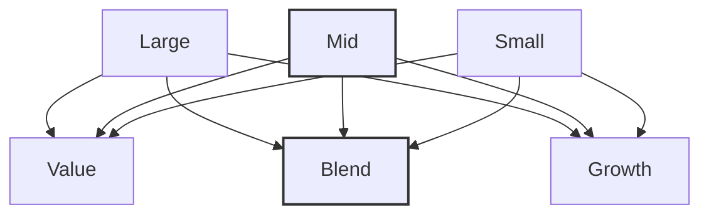

# Vanguard S&P Mid-Cap 400 ETF | IVOO

As of June 30, 2025

# # Investment approach

- Seeks to track the performance of the S&P MidCap 400 Index.
- Mid-cap equity.
- Employs a passively managed, full-replication strategy.
- Fund remains fully invested.
- Low expenses minimize net tracking error.

# # Investment focus

- Central tendency (represented by a black dot in the "Mid" and "Blend" intersection)
- Expected range of fund holdings (represented by the gray oval spanning across "Mid" row)

# # About the benchmark

- The S&P MidCap 400 Index is composed of mid-cap stocks from the broad U.S. equity market.
- Includes stocks of 400 medium-sized U.S. companies, representing a spectrum of industries. On average, these stocks have smaller market capitalizations than those in the S&P 500 Index.

# # Quick facts

<table>
  <tr>
    <td>Benchmark</td>
<td>S&P MidCap 400 Index</td>
  </tr>
<tr>
    <td>Expense ratio1</td>
<td>0.07%</td>
  </tr>
<tr>
    <td>Dividend schedule</td>
<td>Quarterly</td>
  </tr>
<tr>
    <td>ETF total net assets</td>
<td>$2,652 million</td>
  </tr>
<tr>
    <td>Fund total net assets</td>
<td>$4,292 million</td>
  </tr>
<tr>
    <td>Inception date</td>
<td>2010-09-07</td>
  </tr>
</table>

# # Performance history

Total returns2 for period ended June 30, 2025

<table>
  <thead>
    <tr>
      <th>IVOO (Inception 2010-09-07)</th>
      <th>Quarter</th>
      <th>Year to date</th>
      <th>1 year</th>
      <th>3 years</th>
      <th>5 years</th>
      <th>10 years</th>
      <th>Since inception</th>
    </tr>
  </thead>
  <tbody>
    <tr>
      <td>Net asset value (NAV) return3</td>
<td>6.70%</td>
<td>0.17%</td>
<td>7.44%</td>
<td>12.73%</td>
<td>13.34%</td>
<td>9.14%</td>
<td>11.61%</td>
    </tr>
<tr>
      <td>Market price return4</td>
<td>6.72</td>
<td>0.18</td>
<td>7.49</td>
<td>12.73</td>
<td>13.33</td>
<td>9.13</td>
<td>11.61</td>
    </tr>
<tr>
      <td>S&P MidCap 400 Index</td>
<td>6.71</td>
<td>0.20</td>
<td>7.53</td>
<td>12.83</td>
<td>13.44</td>
<td>9.25</td>
<td>11.73</td>
    </tr>
  </tbody>
</table>

The performance data shown represent past performance, which is not a guarantee of future results. Investment returns and principal value will fluctuate, so investors' shares, when sold, may be worth more or less than their original cost. Current performance may be lower or higher than the performance data cited. For performance data current to the most recent month-end, visit our website at vanguard.com/performance. The performance of an index is not an exact representation of any particular investment, as you cannot invest directly in an index.

# # Trading information

<table>
  <tr>
    <td>Ticker symbol</td>
<td>IVOO</td>
  </tr>
<tr>
    <td>CUSIP number</td>
<td>921932885</td>
  </tr>
<tr>
    <td>IIV (intra-day ticker)</td>
<td>IVOO.IV</td>
  </tr>
<tr>
    <td>Index ticker (Bloomberg)</td>
<td>SPTRMDCP</td>
  </tr>
<tr>
    <td>Exchange</td>
<td>NYSE Arca</td>
  </tr>
</table>

Investment Products: Not FDIC Insured • No Bank Guarantee • May Lose Value

1. As reported in the most recent prospectus. A fund's current expense ratio may be lower or higher than the figure reported in the prospectus.
2. Figures for periods of less than one year are cumulative returns. All other figures represent average annual returns. Fund performance figures assume the reinvestment of dividends and capital gains distributions; the figures are pre-tax and net of expenses. The above widely used comparative index represents unmanaged or average returns on various financial assets that can be compared with the fund's total returns for the purpose of measuring relative performance.
3. As of 4 p.m., Eastern time, when the regular trading session of the New York Stock Exchange typically closes.
4. Effective July 15, 2024, the market price returns are calculated using the official closing price as reported by the ETF's primary exchange. Prior to July 15, 2024, the market price returns were calculated using the midpoint between the bid and ask prices as of the closing time of the New York Stock Exchange (typically 4 p.m., Eastern time). The returns shown do not represent the returns you would receive if you traded shares at other times.
# Vanguard S&P Mid-Cap 400 ETF | IVOO

As of June 30, 2025

# # Expense ratio comparison¹

<table>
<tr>
<td></td>
<td>1.06%</td>
<td></td>
</tr>
<tr>
<td></td>
<td>0.44%</td>
<td></td>
</tr>
<tr>
<td></td>
<td></td>
<td>0.07%</td>
</tr>
<tr>
<td>Mid-Cap Core Funds Average</td>
<td>Mid-Cap Core Funds Average ETFs only</td>
<td>S&P Mid-Cap 400 ETF</td>
</tr>
</table>

# # ETF attributes

<table>
<thead>
<tr>
<th>ETF attributes</th>
<th>S&P Mid-Cap 400 ETF</th>
<th>S&P MidCap 400 Index</th>
</tr>
</thead>
<tbody>
<tr>
<td>Number of stocks</td>
<td>401</td>
<td>401</td>
</tr>
<tr>
<td>Median market cap</td>
<td>$9.3B</td>
<td>$9.3B</td>
</tr>
<tr>
<td>Price/earnings ratio</td>
<td>20.3x</td>
<td>20.3x</td>
</tr>
<tr>
<td>Price/book ratio</td>
<td>2.5x</td>
<td>2.5x</td>
</tr>
<tr>
<td>Return on equity</td>
<td>13.2%</td>
<td>13.2%</td>
</tr>
<tr>
<td>Earnings growth rate</td>
<td>16.6%</td>
<td>16.6%</td>
</tr>
<tr>
<td>Foreign holdings</td>
<td>0.7%</td>
<td>0.0%</td>
</tr>
<tr>
<td>Turnover rate²</td>
<td>19.3%</td>
<td>—</td>
</tr>
<tr>
<td>Standard deviation³</td>
<td>20.01%</td>
<td>20.00%</td>
</tr>
</tbody>
</table>

# # Ten largest holdings and % of total net assets⁴

<table>
<tbody>
<tr>
<td>Interactive Brokers Group Inc.</td>
<td>0.8%</td>
</tr>
<tr>
<td>EMCOR Group Inc.</td>
<td>0.8%</td>
</tr>
<tr>
<td>Guidewire Software Inc.</td>
<td>0.7%</td>
</tr>
<tr>
<td>RB Global Inc.</td>
<td>0.7%</td>
</tr>
<tr>
<td>Flex Ltd.</td>
<td>0.7%</td>
</tr>
<tr>
<td>Casey's General Stores Inc.</td>
<td>0.6%</td>
</tr>
<tr>
<td>Comfort Systems USA Inc.</td>
<td>0.6%</td>
</tr>
<tr>
<td>Curtiss-Wright Corp.</td>
<td>0.6%</td>
</tr>
<tr>
<td>Pure Storage Inc.</td>
<td>0.6%</td>
</tr>
<tr>
<td>US Foods Holding Corp.</td>
<td>0.6%</td>
</tr>
<tr>
<td>Top ten as % of total net assets</td>
<td>6.8%</td>
</tr>
</tbody>
</table>

# # Sector Diversification⁵

<table>
<tbody>
<tr>
<td>Industrials</td>
<td>22.8%</td>
</tr>
<tr>
<td>Financials</td>
<td>18.3%</td>
</tr>
<tr>
<td>Consumer Discretionary</td>
<td>13.3%</td>
</tr>
<tr>
<td>Information Technology</td>
<td>11.6%</td>
</tr>
<tr>
<td>Health Care</td>
<td>8.6%</td>
</tr>
<tr>
<td>Real Estate</td>
<td>6.9%</td>
</tr>
<tr>
<td>Consumer Staples</td>
<td>5.4%</td>
</tr>
<tr>
<td>Materials</td>
<td>5.4%</td>
</tr>
<tr>
<td>Energy</td>
<td>3.7%</td>
</tr>
<tr>
<td>Utilities</td>
<td>2.9%</td>
</tr>
<tr>
<td>Communication Services</td>
<td>1.2%</td>
</tr>
<tr>
<td>Other</td>
<td>0.0%</td>
</tr>
</tbody>
</table>

1. Represents the expense ratio for the Vanguard ETF as reported in the most recent prospectus. There are material differences between mutual funds and ETFs. Unlike mutual funds, ETFs are priced continuously and bought and sold throughout the day in the secondary market (at a premium or discount to net asset value) with the assistance of a stockbroker, which entails paying commissions. Sources: Lipper, a Thomson Reuters Company, and Vanguard, December 31, 2024.
2. For most recent fiscal year. Turnover rate excludes the value of portfolio securities received or delivered as a result of in-kind purchases or redemptions of the fund's capital shares, including Vanguard ETF Creation Units.
3. A measure of the volatility of a fund—based on the fund's last three years of monthly returns—used to indicate the dispersion of past returns. A higher standard deviation means a greater potential for volatility. For funds with less than 36 months of performance history, standard deviation is not calculated.
4. The holdings listed exclude any temporary cash investments and equity index products.
5. Sector categories are based on the Global Industry Classification Standard ("GICS"), except for the "Other" category (if applicable), which includes securities that have not been provided a GICS classification as of the effective reporting period.

Vanguard ETF® shares are not redeemable with the issuing fund other than in very large aggregations worth millions of dollars. Instead, investors must buy or sell Vanguard ETF shares in the secondary market and hold those shares in a brokerage account. In doing so, the investor may incur brokerage commissions and may pay more than net asset value when buying and receive less than net asset value when selling.

All ETF products are subject to risk, which may result in the loss of principal. Prices of mid-cap ETF products often fluctuate more than those of large-cap ETF products.

The index is a product of S&P Dow Jones Indices LLC, a division of S&P Global, or its affiliates ("SPDJI"), and has been licensed for use by Vanguard. Standard & Poor's® and S&P® are registered trademarks of Standard & Poor's Financial Services LLC, a division of S&P Global ("S&P"); Dow Jones® is a registered trademark of Dow Jones Trademark Holdings LLC ("Dow Jones"); and these trademarks have been licensed for use by SPDJI and sublicensed for certain purposes by Vanguard. Vanguard products are not sponsored, endorsed, sold or promoted by SPDJI, Dow Jones, S&P, or their respective affiliates and none of such parties make any representation regarding the advisability of investing in such product(s) nor do they have any liability for any errors, omissions, or interruptions of the index.

CGS identifiers have been provided by CUSIP Global Services, managed on behalf of the American Bankers Association by Standard & Poor's Financial Services, LLC, and are not for use or dissemination in a manner that would serve as a substitute for any CUSIP service. The CUSIP Database, © 2025 American Bankers Association. "CUSIP" is a registered trademark of the American Bankers Association.

For more information about Vanguard ETF Shares, visit vanguard.com, call 866-499-8473, or contact your broker to obtain a prospectus or, if available, a summary prospectus. Investment objectives, risks, charges, expenses, and other important information are contained in the prospectus; read and consider it carefully before investing.

© 2025 The Vanguard Group, Inc. All rights reserved. Vanguard Marketing Corporation, Distributor.            F3342_062025
